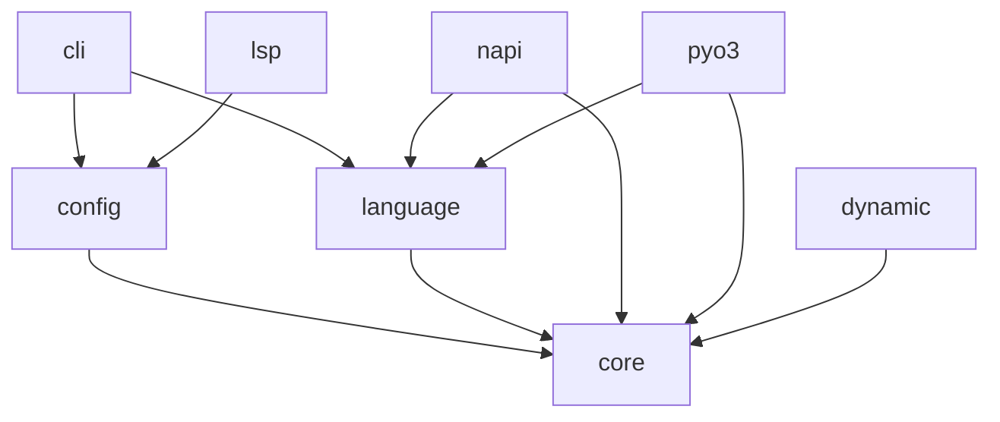

## 一、项目结构与依赖关系

项目主要模块如下：

| Crate | 路径 | 职责 |
| :--- | :--- | :--- |
| `core` | `crates/core` | 核心匹配和替换逻辑，不依赖任何 IO。这层写得很干净。 |
| `config` | `crates/config` | 解析 YAML 规则，在 `core` 之上构建声明式 API。 |
| `language` | `crates/language` | 各种语言的 tree-sitter parser 绑定，还有个 `Expando Char` 的 hack（后面细说）。 |
| `cli` | `crates/cli` | 命令行入口，用 `clap` 做参数解析，`ignore` 遍历文件。 |
| `lsp` | `crates/lsp` | `tower-lsp` 套壳，给 IDE 用的。 |
| `dynamic` | `crates/dynamic` | 动态加载 `.so`/`.dylib` 格式的 tree-sitter 语言包。 |
| `napi` / `pyo3` | `crates/napi`, `crates/pyo3` | JS 和 Python 的绑定。 |

依赖关系画出来大概是这样：



`core` 处于最底层，不依赖任何上层模块，这个设计很关键——意味着你可以单独把 `core` 拿出来嵌入到自己的工具里，不用拖上 CLI 或者配置系统的依赖。

---

## 二、Core Crate：匹配引擎的核心

这块是整个项目的核心。

### 2.1 Node 与 Root 抽象

ast-grep 没有直接暴露 `tree_sitter::Node`，而是包了一层 `Node<'r, D: Doc>`。源码在 `crates/core/src/node.rs`：

```rust
pub struct Node<'r, D: Doc> {
  pub(crate) inner: D::Node<'r>,
  pub(crate) root: &'r Root<D>,
}
```

这里用了泛型 `D: Doc` 来抽象源码的存储方式。为什么需要这个？

1. **编码适配**：CLI 用的是 UTF-8 字符串（`StrDoc`），但 N-API 绑定需要适配 V8 的 UTF-16 编码。通过 `Doc` trait，不同编码可以有不同的 offset 计算逻辑。
2. **方法扩展**：在 `Node` 上可以挂一堆 utility 方法（`find`, `matches`, `inside`, `has`, `children`, `parent` 等），用起来像 jQuery：

```rust
// 典型用法
let root = lang.ast_grep(source_code);
if let Some(node) = root.root().find("console.log($MSG)") {
    println!("Found: {}", node.text());
}
```

`Root<D>` 则是整个文档的根，持有源码和 tree-sitter 的 `Tree` 对象。

### 2.2 Matcher Trait：匹配器接口

匹配器的核心是 `Matcher` trait，定义在 `crates/core/src/matcher.rs`：

```rust
pub trait Matcher<L: Language> {
  fn match_node_with_env<'tree, D: Doc<Lang = L>>(
    &self,
    node: Node<'tree, D>,
    env: &mut Cow<MetaVarEnv<'tree, D>>,
  ) -> Option<Node<'tree, D>>;

  // 还有一些默认实现的辅助方法
  fn find_node<'tree, D: Doc<Lang = L>>(&self, node: Node<'tree, D>) -> Option<NodeMatch<'tree, D>>;
  fn find_all<'tree, D: Doc<Lang = L>>(&self, node: Node<'tree, D>) -> impl Iterator<Item = NodeMatch<'tree, D>>;
}
```

`MetaVarEnv` 是元变量环境，用来存储匹配过程中捕获的 `$VAR` 对应的节点。这个设计很灵活，因为不同的 `Matcher` 实现可以组合：

- `Pattern`：最常用，基于代码模式匹配
- `KindMatcher`：按节点类型匹配（比如 `kind: function_declaration`）
- `RegexMatcher`：对节点文本做正则匹配
- 组合匹配器：`All`, `Any`, `Not` 等

### 2.3 Pattern 编译过程

写模式串 `if ($A) { $B }`，内部发生了什么？这个过程分几步：

**Step 1: 预处理**

如果语言不支持 `$` 作为标识符（比如 Python），先做 Expando Char 替换，把 `$A` 变成 `µA`。

**Step 2: 解析**

用目标语言的 tree-sitter parser 把模式串 parse 成 AST。

**Step 3: 编译成 PatternNode**

遍历这个 AST，转成内部的 `PatternNode` 枚举：

```rust
pub enum PatternNode {
  MetaVar {
    meta_var: MetaVariable,  // 元变量，如 $A, $_, $$$REST
  },
  Terminal {
    text: String,
    is_named: bool,
    kind_id: u16,
  },
  Internal {
    kind_id: u16,
    children: Vec<PatternNode>,
  },
}
```

关于 `MetaVariable`，有几种变体：
- `$VAR`：普通元变量，捕获单个节点
- `$_`：匿名元变量，匹配但不捕获
- `$$$VAR`：Ellipsis，匹配零个或多个连续节点

**Step 4: 匹配**

拿编译好的 `PatternNode` 树去跟目标代码的 AST 对齐。核心逻辑在 `crates/core/src/match_tree/mod.rs` 的 `match_node_impl` 函数，用的是非递归的迭代实现（避免深层 AST 导致栈溢出）。

### 2.4 Replacer 与缩进修正

替换逻辑在 `crates/core/src/replacer/` 目录下。`TemplateFix` 是最常用的实现，处理模板字符串：

```rust
// 用法示例
let fixer = TemplateFix::try_new("const $A = $B", lang)?;
let replacement = fixer.generate_replacement(&node_match);
```

这里有个细节：**自动缩进修正**。

场景是这样的：如果你从缩进 4 格的地方抓了段多行代码，要贴到缩进 2 格的地方。直接替换的话格式就乱了。

`TemplateFix` 的实现里有个 `DeindentedExtract`，会计算相对缩进：

1. 找到被替换节点的首行缩进
2. 找到替换模板的首行缩进
3. 计算差值，对替换文本的每一行做调整

实现不复杂（几十行代码），但这个如果没处理好很影响体验。

---

## 三、Config Crate：声明式规则系统

`core` 提供的是命令式 API（手动调 `find`, `matches`），`config` crate 在上面封了一层 YAML DSL，让用户可以用配置文件定义规则。

### 3.1 规则解析

YAML 规则最终会被反序列化为 `SerializableRule` 结构体（`crates/config/src/rule/mod.rs`）：

```rust
pub struct SerializableRule {
  // 原子规则
  pub pattern: Maybe<PatternStyle>,
  pub kind: Maybe<String>,
  pub regex: Maybe<String>,
  
  // 关系规则
  pub inside: Maybe<Box<Relation>>,
  pub has: Maybe<Box<Relation>>,
  pub precedes: Maybe<Box<Relation>>,
  pub follows: Maybe<Box<Relation>>,
  
  // 组合规则
  pub all: Maybe<Vec<SerializableRule>>,
  pub any: Maybe<Vec<SerializableRule>>,
  pub not: Maybe<Box<SerializableRule>>,
  pub matches: Maybe<String>,  // 引用其他规则
  
  // ...其他字段
}
```

规则分三大类：

**原子规则**：
- `pattern`：代码模式匹配
- `kind`：节点类型匹配
- `regex`：正则匹配

**关系规则**：
- `inside`：当前节点在某个祖先节点内
- `has`：当前节点包含某个后代节点
- `precedes`：当前节点在某节点之前（兄弟关系）
- `follows`：当前节点在某节点之后

关系规则有个 `stopBy` 参数，用来控制搜索边界。比如"找函数内的 `console.log`，但不要跨进嵌套的箭头函数"，可以这样写：

```yaml
rule:
  pattern: console.log($$$ARGS)
  inside:
    kind: function_declaration
    stopBy: arrow_function
```

**组合规则**：
- `all`：所有子规则都满足
- `any`：任一子规则满足
- `not`：子规则不满足
- `matches`：引用其他已定义的规则（支持循环依赖检测）

### 3.2 CSS 选择器语法

除了 YAML，ast-grep 还支持类 CSS 选择器的语法，比如：

```
function_declaration > identifier
```

表示"直接子节点是 identifier 的 function_declaration"。

实现在 `crates/config/src/rule/selector.rs`，自己写了个 lexer + parser，没用第三方库。支持的组合子：
- `A B`：后代
- `A > B`：直接子节点
- `A + B`：紧邻兄弟
- `A ~ B`：一般兄弟

### 3.3 Transform 与 Fixer

`transform` 允许在替换前对捕获的元变量做处理：

```yaml
rule:
  pattern: $FUNC($$$ARGS)
transform:
  FUNC_UPPER:
    uppercase: $FUNC
fix: $FUNC_UPPER($$$ARGS)
```

更强大的是 `rewrite`，可以在捕获的节点上运行另一个子规则，用子规则的 fix 结果作为变量值：

```yaml
rewriters:
  - id: convert-require
    rule:
      pattern: require($PATH)
    fix: import($PATH)

rule:
  pattern: $STMT
transform:
  NEW_STMT:
    rewrite:
      source: $STMT
      rewriters: [convert-require]
fix: $NEW_STMT
```

这个功能在做复杂重构时很有用。

---

## 四、Language Crate：多语言支持

### 4.1 Language Trait

所有语言都要实现 `Language` trait（`crates/core/src/language.rs`）：

```rust
pub trait Language: Clone {
  fn kind_to_id(&self, kind: &str) -> u16;
  fn field_to_id(&self, field: &str) -> Option<u16>;
  fn meta_var_char(&self) -> char { '$' }
  fn expando_char(&self) -> char { self.meta_var_char() }
  fn pre_process_pattern<'q>(&self, query: &'q str) -> Cow<'q, str>;
  fn build_pattern(&self, builder: &PatternBuilder) -> Result<Pattern, PatternError>;
}
```

`SupportLang` 枚举（`crates/language/src/lib.rs`）列举了所有内置语言：

```rust
pub enum SupportLang {
  Bash, C, Cpp, CSharp, Css, Elixir, Go,
  Haskell, Hcl, Html, Java, JavaScript, Json,
  Kotlin, Lua, Nix, Php, Python, Ruby, Rust,
  Scala, Solidity, Swift, Tsx, TypeScript, Yaml,
}
```

### 4.2 Expando Char Hack

这里的实现很有意思。

问题：`$` 在很多语言里不是合法的标识符字符。你写 `if ($A): pass` 想匹配 Python 代码，Python 的 parser 会直接报错，因为 `$A` 不是合法变量名。

解法：**Expando Char**。在 parse 模式串之前，先把 `$` 替换成一个在目标语言里合法的、不常用字符。

代码在两个宏里：

```rust
// 不需要 expando 的语言（如 JS，本身支持 $ 做标识符）
macro_rules! impl_lang {
  ($lang: ident, $func: ident) => {
    impl Language for $lang {
      fn meta_var_char(&self) -> char { '$' }
      fn expando_char(&self) -> char { '$' }  // 相同，不需要替换
      // ...
    }
  }
}

// 需要 expando 的语言
macro_rules! impl_lang_expando {
  ($lang: ident, $func: ident, $char: literal) => {
    impl Language for $lang {
      fn meta_var_char(&self) -> char { '$' }
      fn expando_char(&self) -> char { $char }  // 替换成这个字符
      fn pre_process_pattern<'q>(&self, query: &'q str) -> Cow<'q, str> {
        // 把 $ 替换成 expando_char
        Cow::Owned(query.replace('$', &self.expando_char().to_string()))
      }
      // ...
    }
  }
}
```

比如 Python 用的是 `µ`，所以 `if ($A): pass` 会变成 `if (µA): pass`，这对 Python parser 来说是合法代码。parse 完之后，ast-grep 识别到 `µA` 节点，再标记回 MetaVar `$A`。

JavaScript/TypeScript 这种本身允许 `$` 做标识符的语言就不用这步了。

### 4.3 Parser 加载

`crates/language/src/parsers.rs` 用条件编译控制 parser 的链接：

```rust
macro_rules! conditional_lang {
  ($lang: ident, $flag: literal) => {{
    #[cfg(feature=$flag)]
    { $lang::LANGUAGE.into() }
    #[cfg(not(feature=$flag))]
    { unimplemented!("tree-sitter parser not compiled") }
  }};
}

pub fn language_python() -> TSLanguage {
  conditional_lang!(tree_sitter_python, "tree-sitter-python")
}
```

这样可以通过 Cargo features 控制编译哪些语言，减少二进制体积。

---

## 五、CLI Crate：为什么快

跑大项目时 ast-grep 比很多工具快，主要靠这几点：

### 5.1 并行遍历

用的 `ignore` crate（ripgrep 同款），核心是 `WalkParallel`：

```rust
// crates/cli/src/scan.rs
fn build_walk(&self) -> Result<WalkParallel> {
  let mut langs = HashSet::new();
  self.configs.for_each_rule(|rule| {
    langs.insert(rule.language);
  });
  self.arg.input.walk_langs(langs.into_iter())
}
```

这个 walker 会：
1. 并行扫描目录
2. 自动尊重 `.gitignore`
3. 按文件扩展名过滤

### 5.2 规则合并

`CombinedScan`（`crates/config/src/combined.rs`）是个关键优化：

```rust
pub struct CombinedScan<'r, L: Language> {
  rules: Vec<&'r RuleConfig<L>>,
  // ...
}

impl CombinedScan {
  pub fn scan(&self, grep: &AstGrep<D>, separate_fix: bool) -> ScanResult {
    // 一次 parse，多个规则复用同一个 AST
  }
}
```

假设有 50 个 TypeScript 规则，AST 只 parse 一次，然后让这 50 个规则都跑一遍。比每个规则重新 parse 一遍快几个数量级。

### 5.3 Worker 模式

CLI 用的是生产者-消费者模式：

1. **生产者**：`WalkParallel` 并行扫目录，产出文件路径
2. **消费者**：多个 worker 线程从队列抢文件，每个线程独立 parse + 匹配

```rust
impl PathWorker for ScanWithConfig {
  fn produce_item<P: Printer>(&self, path: &Path, processor: &P::Processor) -> Result<Vec<P::Processed>> {
    let items = filter_file_rule(path, &self.configs, &self.trace)?;
    for grep in items {
      let rules = self.configs.get_rule_from_lang(path, *grep.lang());
      let mut combined = CombinedScan::new(rules);
      let scanned = combined.scan(&grep, interactive);
      // ...处理结果
    }
  }
}
```

---

## 六、LSP Crate：IDE 集成

`crates/lsp` 用 `tower-lsp` 实现了 Language Server Protocol，主要功能：

### 6.1 实时诊断

文件打开或变更时，跑所有规则，把 match 转成 LSP Diagnostic：

```rust
fn get_diagnostics(&self, uri: &Uri, versioned: &VersionedAst) -> Option<Vec<Diagnostic>> {
  let rules = self.rules.read().ok()?;
  let mut scan = CombinedScan::new(rules.for_path(&path));
  let matches = scan.scan(&versioned.root, false).matches;
  
  matches.into_iter().map(|(rule, ms)| {
    convert_match_to_diagnostic(uri, &m, rule)
  }).collect()
}
```

### 6.2 Code Action

提供 `quickfix.ast-grep` 和 `source.fixAll.ast-grep` 两种 code action：

```rust
const QUICKFIX_AST_GREP: &str = "quickfix.ast-grep";
const FIX_ALL_AST_GREP: &str = "source.fixAll.ast-grep";
```

用户可以单个修复，也可以一键全部修复。

### 6.3 热重载

监听 `*.yml` 文件变更，自动重新加载规则：

```rust
async fn did_change_watched_files(&self, _params: DidChangeWatchedFilesParams) {
  if let Err(e) = self.reload_rules().await {
    self.client.show_message(MessageType::ERROR, format!("Failed to reload rules: {e}")).await;
  }
}
```

---

## 七、Dynamic Crate：动态加载语言

`crates/dynamic` 支持运行时加载 tree-sitter 语言包（`.so`/`.dylib`），不用重编译 ast-grep。

核心是 `libloading`：

```rust
unsafe fn load_ts_language(path: PathBuf, name: String) -> Result<(Library, TSLanguage), DynamicLangError> {
  let lib = Library::new(abs_path.as_os_str())?;
  let func: Symbol<unsafe extern "C" fn() -> NativeTS> = lib.get(name.as_bytes())?;
  let lang = func();
  
  // 检查 ABI 版本兼容性
  let version = lang.abi_version();
  if !(MIN_COMPATIBLE_LANGUAGE_VERSION..=LANGUAGE_VERSION).contains(&version) {
    return Err(DynamicLangError::IncompatibleVersion(version));
  }
  
  Ok((lib, lang))
}
```

注意这里 `lib` 必须保持 live，因为 `TSLanguage` 的生命周期依赖于它。一旦 `Library` 被 drop，语言对象就变成悬垂指针了。

配置示例（`sgconfig.yml`）：

```yaml
customLanguages:
  vue:
    libraryPath: ./tree-sitter-vue.so
    extensions: [vue]
    expandoChar: "µ"
```

---

## 八、Bindings：NAPI 与 PyO3

### 8.1 Node.js (napi-rs)

`crates/napi` 用 `napi-rs` 把 Rust 类型暴露给 JS：

```rust
#[napi]
pub fn parse(lang: String, src: String) -> Result<SgRoot> {
  let doc = JsDoc::try_new(src, lang.parse()?)?;
  Ok(SgRoot(AstGrep::doc(doc), "anonymous".into()))
}

#[napi]
pub fn find_in_files(
  lang: String,
  config: FindConfig,
  callback: Function<Vec<SgNode>, ()>,
) -> Result<AsyncTask<FindInFiles>> {
  // 透传 Rust 多线程能力给 Node.js
}
```

`find_in_files` 是个 async 接口，内部用 Rust 线程池，不会阻塞 Node.js 事件循环，还能跑满 CPU。

### 8.2 Python (pyo3)

`crates/pyo3` 用 PyO3 做类似的事：

```rust
#[pyclass]
struct SgRoot {
  inner: AstGrep<StrDoc<PyLang>>,
  filename: String,
}

#[pymethods]
impl SgRoot {
  #[new]
  fn new(src: &str, lang: &str) -> Self {
    let lang: PyLang = lang.parse().unwrap();
    let inner = lang.ast_grep(src);
    Self { inner, filename: "anonymous".into() }
  }

  fn root(slf: PyRef<Self>) -> SgNode {
    // ...
  }
}
```

还暴露了 `register_dynamic_language` 让 Python 用户可以运行时加载自定义语言。

---

## 九、小结

整体看下来，ast-grep 的代码质量不错，几个设计亮点：

1. **模块边界清晰**：`core` 完全不依赖 IO，可以独立使用。`config` 只负责规则解析，不管 CLI 细节。

2. **性能优化到位**：`CombinedScan` 避免重复 parse，`WalkParallel` 并行遍历，这些细节拉开了和其他工具的差距。

3. **Expando Char**：虽然有点 hacky，但优雅地解决了"模式串语法不合法"的问题，比魔改 parser 简单多了。

4. **泛型抽象合理**：`Doc` trait 抽象编码，`Language` trait 抽象语言，`Matcher` trait 抽象匹配器，各司其职。

5. **跨语言绑定完整**：NAPI 和 PyO3 都做得比较完善，性能没有明显损失。

