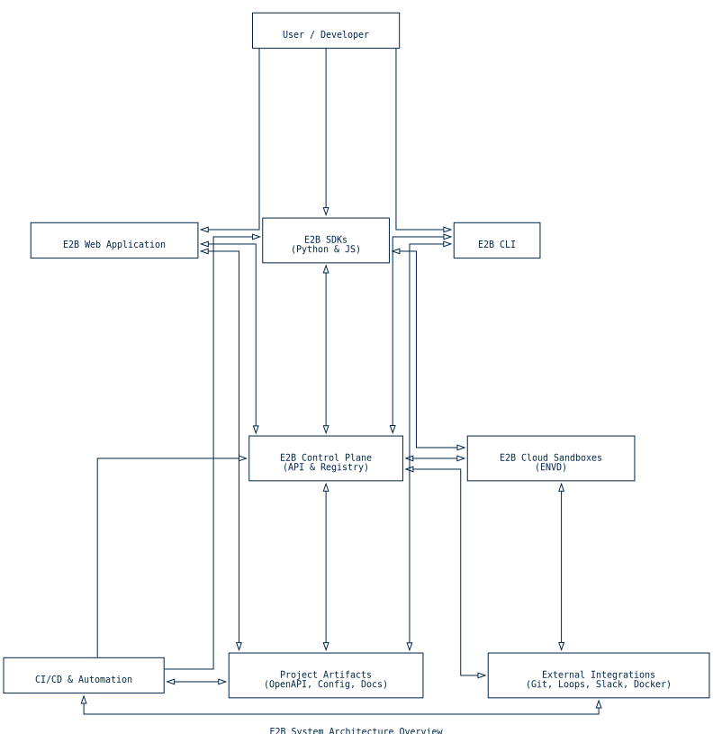

> E2B（Everything to Build）是一个为 AI 应用提供安全云端沙箱环境的开源平台。
>
> 读完这一篇，你大致可以搞清三件事：① E2B 想解决的核心问题是什么，而不是「再造一个 Docker」；② 整个仓库怎么拆分成 SDK、CLI、控制平面等模块；③ 从 Dockerfile 到 Firecracker MicroVM 中间到底发生了什么。



*E2B 系统架构概览：开发者可以通过 CLI、SDK 或 Web 界面与控制平面交互，控制平面进一步编排云端沙箱、项目制品以及外部集成。*

## 一、E2B 是什么

**一句话总结**：E2B 为 AI Agent 提供安全的、即时可用的云端沙箱环境，让它们可以安全地执行代码、访问文件系统和与外部服务交互。

在《沙箱技术（一）》中我们梳理了沙箱技术的演进脉络，E2B 正是「AI 沙箱平台」这一阶段的典型代表——它把 Firecracker MicroVM 的强隔离能力与 Docker 的易用性结合起来，专门服务于 AI Agent 的代码执行场景。简单理解就是：**用 Docker 的开发体验，换来接近 VM 的安全边界**。

## 二、项目结构：Monorepo 概览

E2B 使用 `pnpm` 管理的 monorepo 架构，核心包如下：

| 包 (Package)                  | 路径           | 描述                                                         |
| ----------------------------- | -------------- | ------------------------------------------------------------ |
| **JavaScript/TypeScript SDK** | `js-sdk`       | 官方 JS/TS SDK，用于创建和控制沙箱，包名为 `e2b`             |
| **Python SDK**                | `python-sdk`   | 官方 Python SDK，功能与 JS SDK 对齐，包名为 `e2b`            |
| **命令行工具 (CLI)**          | `cli`          | 用于构建和管理自定义沙箱模板，包名为 `@e2b/cli`              |
| **文档网站**                  | `web`          | 基于 Next.js 的官方文档网站 (e2b.dev)                        |
| **API 规范**                  | `spec`         | 包含 `openapi.yml` 等 API 定义文件，是 SDK 与后端通信的契约  |

这种 monorepo 结构的好处是：SDK、CLI、文档可以共享类型定义和 API 规范，保持一致性；同时各包又能独立发布和版本管理。

## 三、核心概念

### 1. 沙箱（Sandbox）

**是什么**：一个轻量级、隔离的云端 Linux 环境。

**技术选型**：基于 **Firecracker MicroVM**，这是 AWS Lambda 和 Fargate 底层使用的虚拟化技术。相比传统 Docker 容器：

| 特性         | Docker 容器                | Firecracker MicroVM        |
| ------------ | -------------------------- | -------------------------- |
| 隔离级别     | 共享宿主内核               | 独立内核                   |
| 安全边界     | 依赖 cgroups/namespaces    | 硬件虚拟化（KVM）          |
| 启动速度     | 毫秒级                     | 毫秒级（~125ms）           |
| 内存开销     | 较低                       | 约 5MB 起                  |
| 多租户安全性 | 需要额外加固               | 天然强隔离                 |

**用途**：AI Agent 可以在沙箱中安全地：
- 执行任意代码（Python、Bash、Node.js 等）
- 读写文件系统
- 安装依赖包
- 访问网络（受控）

而不会影响到宿主或其他沙箱。

### 2. 模板（Template）

**是什么**：沙箱的蓝图或配置，定义了沙箱的基础环境。

**如何定义**：用户通过编写标准的 **Dockerfile** 来定义模板。这个设计非常聪明：
- 降低学习成本（Dockerfile 大家都会写）
- 复用 Docker 庞大的生态（基础镜像、多阶段构建等）
- 与现有 CI/CD 流程兼容

换句话说，E2B 没有发明一套新的「镜像格式」或「打包方式」，而是**站在 Docker 生态之上做增量设计**：开发体验保持不变，运行时从容器升级为 MicroVM。

### 3. 构建流程：从 Dockerfile 到 MicroVM

从工程实现角度看，E2B 把 Docker 的构建流程和 MicroVM 的运行时组合在一起：

```
┌─────────────────────────────────────────────────────────────────┐
│                        构建流程                                  │
├─────────────────────────────────────────────────────────────────┤
│                                                                 │
│  ┌──────────────┐    ┌──────────────┐    ┌──────────────┐      │
│  │  Dockerfile  │───▶│ Docker 镜像  │───▶│  E2B 仓库    │      │
│  └──────────────┘    └──────────────┘    └──────────────┘      │
│        │                   │                   │                │
│        │ e2b template      │ docker build      │ push           │
│        │ build             │                   │                │
│        ▼                   ▼                   ▼                │
│  ┌─────────────────────────────────────────────────────────┐   │
│  │                    E2B 后端                              │   │
│  │  ┌──────────────┐    ┌──────────────┐                   │   │
│  │  │ 提取 rootfs  │───▶│ MicroVM 镜像 │                   │   │
│  │  └──────────────┘    └──────────────┘                   │   │
│  └─────────────────────────────────────────────────────────┘   │
│                              │                                  │
│                              │ 用户请求创建沙箱                  │
│                              ▼                                  │
│                    ┌──────────────────┐                        │
│                    │ Firecracker VM   │                        │
│                    │ (运行中的沙箱)    │                        │
│                    └──────────────────┘                        │
│                                                                 │
└─────────────────────────────────────────────────────────────────┘
```

**步骤分解**：

1. **本地构建**：开发者执行 `e2b template build`，CLI 调用本地 Docker 引擎构建标准 Docker 镜像
2. **推送镜像**：CLI 将镜像推送到 E2B 的私有镜像仓库
3. **云端转换**：当 SDK 请求创建沙箱时，后端提取 Docker 镜像的文件系统，转换为 Firecracker 可用的 **rootfs**
4. **启动沙箱**：启动 MicroVM，挂载 rootfs，得到与 Dockerfile 定义一致的隔离环境

这个流程的关键点在于：**开发者只需要会写 Dockerfile，就能获得 MicroVM 级别的安全隔离**。

## 四、E2B 沙箱生命周期设计

从 SDK 使用角度看，一个沙箱（`Sandbox` 实例）的生命周期大致分为 5 个阶段，分别由不同的 API 负责：

### 1. 创建（Create）

- **主要 API**
    - `await Sandbox.create({ template })`
- **作用**
    - 启动一个基于指定模板（默认 `base`）的 Firecracker MicroVM，并在控制平面登记一条沙箱记录。
- **状态变化**
    - 创建成功后，沙箱进入 `Running` 状态。
- **关键参数**
    - `template`: 模板名称或 ID；
    - `timeoutMs`: 最大存活时间，默认约 5 分钟，用于防止沙箱被长时间遗忘不销毁。

> 工程含义：这一步对应控制平面创建沙箱记录、分配资源、拉起 MicroVM，是后续所有操作的前置条件。

### 2. 运行与交互（Running & Interaction）

- **状态**
    - 沙箱处于 `Running`，可以接受命令与文件操作。
- **典型操作**
    - 执行命令：
        - `sandbox.commands.run('echo "hello"')`
    - 文件读写：
        - `sandbox.files.write('path/to/file.txt', 'content')`
        - `sandbox.files.read('path/to/file.txt')`
    - 网络访问：
        - 沙箱内部可以访问外网；
        - 通过 `sandbox.getHost(port)` 把沙箱内端口暴露成一个外部可访问的 URL（例如让 Agent 在沙箱里跑 Web 服务，再在外部发请求）。
- **保活控制**
    - 可以使用 `sandbox.setTimeout(timeoutMs)` 动态调整超时时间；
    - Pro 用户最长可以将单个沙箱生命周期扩展到 **24 小时**。

> 工程含义：这一阶段 SDK 主要负责把「命令、文件操作、端口映射」转换成对控制平面 / 沙箱代理的 RPC 调用，同时维护本地会话状态（如 `sandboxId`、当前超时时间等）。

### 3. 连接（Connect）

- **主要 API**
    - `await Sandbox.connect(sandboxId)`
- **作用**
    - 从另一个进程、服务或 Serverless 函数中，连接到一个**已经存在**的沙箱。
- **典型场景**
    - 多个无状态函数（如 Cloud Functions、Lambda）共享同一个长生命周期沙箱；
    - 本地调试和线上任务共用一个沙箱上下文。

> 工程含义：`connect` 不会新建 MicroVM，而是通过 `sandboxId` 复用控制平面已有记录，建立一个新的客户端会话。

### 4. 暂停与恢复（Pause & Resume，Beta）

- **暂停**
    - `await sandbox.betaPause()`
    - 行为：把沙箱的内存快照和状态持久化到后端存储，停止沙箱运行，释放计算资源（或降到极低）。
- **恢复**
    - `await Sandbox.connect(sandboxId)`
    - 如果目标沙箱当前处于「暂停」状态，`connect` 会触发恢复流程，让沙箱从之前的内存快照继续执行。

> 工程含义：这一能力更像是在控制平面侧对「运行态」和「冷存储态」之间做状态迁移，对 API 使用者来说仍然只是 `pause` / `connect` 两个入口。

### 5. 销毁（Kill）

- **主要 API**
    - `await sandbox.kill()`
- **行为**
    - 显式终止沙箱：停止 MicroVM、清理相关资源，并在控制平面标记为 `Destroyed`。
- **自动销毁策略**
    - 超过设定的 `timeoutMs`；
    - 所有客户端断开连接，且达到一定空闲时间；
    - 控制平面策略主动回收。

> 工程含义：这一阶段的重点是**资源回收和状态一致性**——无论是显式 `kill` 还是超时回收，都需要确保控制平面和底层 MicroVM 状态保持一致。

### 生命周期状态图

```mermaid
graph TD
        A[Start] -->|Sandbox.create()| B(Running)
        B -->|sandbox.commands.run() / files.*()| B
        B -->|sandbox.kill()| D[Destroyed]
        B -->|Timeout / 回收策略| D
        B -->|sandbox.betaPause()| C[Paused]
        C -->|Sandbox.connect()| B
        B -->|Sandbox.connect() from other client| B
```

> 这个设计在资源和灵活性之间做了一个比较务实的平衡：
> - 通过 `timeout` 和自动回收避免「遗忘的沙箱」长期占用资源；
> - 通过 `connect` 和 `betaPause` 允许把沙箱当成一个可复用、可休眠的「工作环境」，适合 AI Agent 长对话或多阶段任务。

## 五、技术栈一览

| 层次     | 技术选型                           |
| -------- | ---------------------------------- |
| SDK      | TypeScript, Python                 |
| CLI      | TypeScript                         |
| 文档     | Next.js                            |
| 构建系统 | pnpm, Turborepo                    |
| API 协议 | OpenAPI, Connect RPC               |
| 虚拟化   | Firecracker MicroVM (KVM)          |
| 容器     | Docker (用于模板定义)              |

## 六、快速上手示例

### 使用沙箱（应用开发者）

**安装 SDK**：

```bash
# Python
pip install e2b

# JavaScript
npm i e2b
```

**基本使用**：

```python
from e2b import Sandbox

# 创建默认沙箱
with Sandbox() as sandbox:
    # 运行 shell 命令
    proc = sandbox.process.start('echo "Hello from E2B!"')
    proc.wait()
    print(proc.stdout)

    # 读写文件
    sandbox.filesystem.write('hello.txt', 'This is inside the sandbox.')
    content = sandbox.filesystem.read('hello.txt')
    print(content)
```

从源码角度看，这里的 `Sandbox` 类对应 JS SDK 中的核心封装（例如 `js-sdk/src/sandbox.ts` 一类的模块，实际路径以后续版本为准），负责对接控制平面 API、管理进程与文件系统。下一篇会重点拆这一层的实现细节：它如何管理沙箱生命周期、如何映射到底层 HTTP / RPC 调用。

### 自定义模板（模板开发者）

**安装 CLI 并认证**：

```bash
npm install -g @e2b/cli
e2b auth login
```

**创建 `e2b.Dockerfile`**：

```dockerfile
FROM python:3.11-slim

# 安装数据科学常用包
RUN pip install pandas numpy matplotlib

# 设置工作目录
WORKDIR /workspace
```

**构建并使用**：

```bash
e2b template build --name data-science-sandbox
```

```python
from e2b import Sandbox

with Sandbox(template='data-science-sandbox') as sandbox:
    code = '''
import pandas as pd
df = pd.DataFrame({'x': [1,2,3], 'y': [4,5,6]})
print(df.describe())
'''
    proc = sandbox.process.start(f'python -c "{code}"')
    proc.wait()
    print(proc.stdout)
```

## 七、与其他沙箱方案的对比

| 方案               | 隔离级别     | 启动速度 | 易用性 | 适用场景                   |
| ------------------ | ------------ | -------- | ------ | -------------------------- |
| Docker 容器        | 进程级       | ~100ms   | ⭐⭐⭐⭐⭐ | 开发/测试，信任代码        |
| gVisor             | 用户态内核   | ~200ms   | ⭐⭐⭐⭐  | 多租户容器，中等安全需求   |
| Firecracker (E2B)  | 硬件虚拟化   | ~125ms   | ⭐⭐⭐⭐  | AI Agent，不信任代码       |
| 传统 VM            | 硬件虚拟化   | 秒级     | ⭐⭐⭐   | 完全隔离，长期运行服务     |

E2B 的定位很清晰：**在保持 Docker 级别易用性的同时，提供 VM 级别的安全隔离**。

## 八、后续文章预告

本文从宏观角度介绍了 E2B 的架构和核心概念。后续文章将深入源码，分析：

- **E2B 源码分析（二）**：SDK 设计——重点查看 `js-sdk/` 和 `python-sdk/` 下围绕 `Sandbox`、进程管理、文件系统操作的核心模块，梳理一套「从用户调用到 HTTP / RPC 请求」的调用链。
- **E2B 源码分析（三）**：CLI 实现——结合 `cli/src/commands/` 中的模板相关命令，追踪 `e2b template build` 如何串起 Docker、本地构建和远端注册表。
- **E2B 源码分析（四）**：API 规范——以 `spec/openapi.yml` 为主线，分析控制平面接口的设计，以及它和 Connect RPC 定义之间的关系。

---

## 参考资料

- [E2B GitHub 仓库](https://github.com/e2b-dev/e2b)
- [E2B 官方文档](https://e2b.dev/docs)
- [Firecracker 官方文档](https://firecracker-microvm.github.io/)
- [沙箱技术（一）：从 chroot 到 Serverless/AI 的统一时间线](/blog/sandbox-tech-1)
