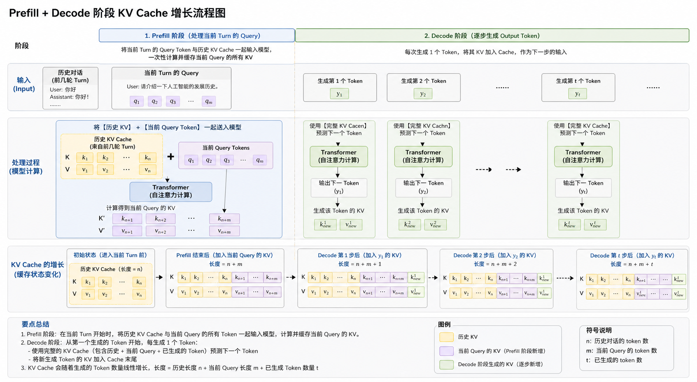
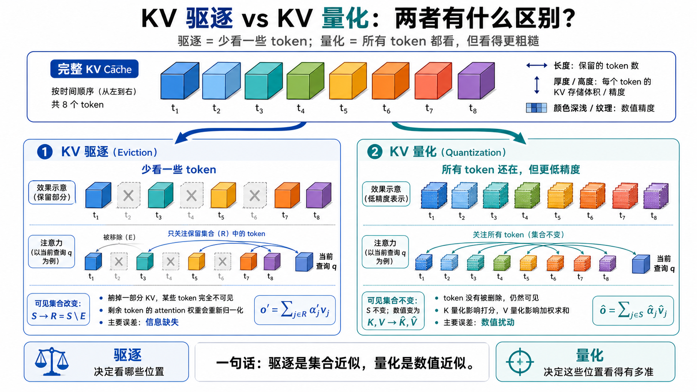

KV Cache 的推理流程里，最容易混淆的一点是：历史 KV、当前 query 的 KV、生成 token 的 KV 究竟怎样合在一起。

一个常见说法会把它写成：

$$
K_{\mathrm{all}}=K_{\mathrm{history}}+K_{\mathrm{query}}
$$

这个写法会把向量加法和序列追加混在一起。更贴近实际机制的写法是沿 token 序列维度拼接：

$$
K_{\mathrm{all}}
=
[K_{\mathrm{history}};\ K_{\mathrm{query}};\ K_{\mathrm{generated}}]
$$

value 也一样：

$$
V_{\mathrm{all}}
=
[V_{\mathrm{history}};\ V_{\mathrm{query}};\ V_{\mathrm{generated}}]
$$

因此，KV Cache 的主线可以概括为：

> 历史 KV 已经写入，当前 query 通过 prefill 一次性追加，decode 阶段每生成一个 token 再追加一个新的 KV。

这篇文章讨论 decoder-only Transformer 的推理阶段。为了让公式聚焦在机制本身，前半部分暂时忽略 batching、paged attention、RoPE、MQA/GQA 和 kernel 细节，只看单层单头的基本形式；多层多头时，每一层、每个 head 都维护对应的 K/V cache。量化会在后文单独讨论。

## 符号表

| 符号 | 含义 |
| --- | --- |
| $H=(x_1,\ldots,x_n)$ | 前几轮对话历史 token |
| $Q=(q_1,\ldots,q_m)$ | 当前用户 query token |
| $Y=(y_1,\ldots,y_T)$ | 当前轮已经生成或即将生成的输出 token |
| $L=n+m$ | history 与 current query 拼接后的长度 |
| $\ell$ | Transformer 层下标 |
| $N$ | Transformer 总层数 |
| $C_s^{(\ell)}$ | 第 $\ell$ 层、长度为 $s$ 的 KV cache |
| $K_{1:s}^{(\ell)},V_{1:s}^{(\ell)}$ | 第 $\ell$ 层缓存中的 key 与 value 序列 |
| $k_i^{(\ell)},v_i^{(\ell)}$ | 第 $i$ 个 token 在第 $\ell$ 层写入 cache 的 key/value |
| $Q_i^{(\ell)}$ | 第 $i$ 个 token 在第 $\ell$ 层当前计算得到的 query 向量 |
| $\alpha_{i,j}^{(\ell)}$ | 第 $i$ 个位置对第 $j$ 个位置的 attention 权重 |
| $h_i^{(N)}$ | 第 $i$ 个位置经过最后一层后的 hidden state |
| $W_{\mathrm{vocab}}$ | LM head / vocab projection |
| $S$ | 某一步 attention 原本可见的 KV 位置集合 |
| $E$ | 被驱逐的 KV 位置集合 |
| $R=S\setminus E$ | 驱逐后保留的 KV 位置集合 |
| $\hat k_j,\hat v_j$ | 量化后近似保存的 key/value |
| $\epsilon_j^K,\epsilon_j^V$ | key/value 量化误差 |
| $\delta_j$ | key 量化导致的 attention score 扰动 |
| $\hat\alpha_j$ | 使用量化 key 计算得到的 attention 权重 |

## 1. 完整输入与 cache 形态

前几轮对话历史 token 记为：

$$
H=(x_1,x_2,\ldots,x_n)
$$

当前用户 query token 记为：

$$
Q=(q_1,q_2,\ldots,q_m)
$$

当前轮 prefill 看到的完整输入是 history 与 query 的拼接：

$$
X
=
H\Vert Q
=
(x_1,\ldots,x_n,q_1,\ldots,q_m)
$$

长度为：

$$
L=n+m
$$

对第 $\ell$ 层 Transformer，把长度为 $s$ 的 cache 写成：

$$
C_s^{(\ell)}
=
\left(
K_{1:s}^{(\ell)},\
V_{1:s}^{(\ell)}
\right)
$$

其中 key 序列是：

$$
K_{1:s}^{(\ell)}
=
[k_1^{(\ell)},k_2^{(\ell)},\ldots,k_s^{(\ell)}]
$$

value 序列是：

$$
V_{1:s}^{(\ell)}
=
[v_1^{(\ell)},v_2^{(\ell)},\ldots,v_s^{(\ell)}]
$$

这里的方括号表示按 token 位置排列的序列。cache 的长度随 token 数增长，新增 token 对应的新 key/value 会追加到序列末尾。

## 2. 历史对话已经写入 KV

如果前几轮 turn 已经完成 prefill，那么第 $\ell$ 层已经有历史 cache：

$$
C_n^{(\ell)}
=
\left(
K_{1:n}^{(\ell)},V_{1:n}^{(\ell)}
\right)
$$

展开 key 序列：

$$
K_{1:n}^{(\ell)}
=
[k_{x_1}^{(\ell)},\ldots,k_{x_n}^{(\ell)}]
$$

展开 value 序列：

$$
V_{1:n}^{(\ell)}
=
[v_{x_1}^{(\ell)},\ldots,v_{x_n}^{(\ell)}]
$$

这部分对应前几轮对话。下一轮用户输入到来时，模型无需重新计算 $x_1,\ldots,x_n$ 的 K/V；它会把这段历史 cache 当作当前 query prefill 的前缀记忆。

## 3. 当前 query 的 prefill

当前 query 是：

$$
Q=(q_1,\ldots,q_m)
$$

prefill 阶段会把这 $m$ 个 query token 一次性送进模型。对第 $\ell$ 层，每个 query token 都会产生自己的 key 和 value：

$$
k_{q_i}^{(\ell)},\ v_{q_i}^{(\ell)},
\qquad
1\le i\le m
$$

于是当前 query 写入的 key 序列是：

$$
K_Q^{(\ell)}
=
[k_{q_1}^{(\ell)},\ldots,k_{q_m}^{(\ell)}]
$$

value 序列是：

$$
V_Q^{(\ell)}
=
[v_{q_1}^{(\ell)},\ldots,v_{q_m}^{(\ell)}]
$$

将它们追加到历史 cache 后得到：

$$
K_{1:n+m}^{(\ell)}
=
[K_{1:n}^{(\ell)};\ K_Q^{(\ell)}]
$$

$$
V_{1:n+m}^{(\ell)}
=
[V_{1:n}^{(\ell)};\ V_Q^{(\ell)}]
$$

用 cache 记号写成：

$$
C_{n+m}^{(\ell)}
=
C_n^{(\ell)}\oplus KV(Q)
$$

展开就是：

$$
C_{n+m}^{(\ell)}
=
[
KV(x_1),\ldots,KV(x_n),
KV(q_1),\ldots,KV(q_m)
]
$$

这里的 $\oplus$ 表示追加。它改变的是 cache 的序列长度和可见位置集合，语义上接近 append，而非两个张量逐元素相加。

## 4. Query prefill 仍然遵守 causal mask

当前 query 虽然一次性送入模型，内部仍然受到 causal mask 约束。

在完整序列中，$q_i$ 的位置是 $n+i$。它可以看到：

$$
x_1,\ldots,x_n,q_1,\ldots,q_i
$$

它看不到 query 内部更靠后的 token：

$$
q_{i+1},\ldots,q_m
$$

因此：

$$
q_1 \to x_1,\ldots,x_n,q_1
$$

$$
q_2 \to x_1,\ldots,x_n,q_1,q_2
$$

一般地：

$$
q_i \to x_1,\ldots,x_n,q_1,\ldots,q_i
$$

prefill 的并行来自矩阵计算；因果性来自 mask。并行计算不改变每个位置的可见范围。

## 5. Prefill 阶段的 attention 公式

对 query token $q_i$，完整序列位置是 $n+i$。在第 $\ell$ 层，它的 attention score 只定义在 $j\le n+i$ 的位置上：

$$
s_{n+i,j}^{(\ell)}
=
\frac{
Q_{n+i}^{(\ell)}
\cdot
K_j^{(\ell)T}
}{
\sqrt{d_k}
},
\qquad
j\le n+i
$$

softmax 后得到：

$$
\alpha_{n+i,j}^{(\ell)}
=
\frac{
\exp(s_{n+i,j}^{(\ell)})
}{
\sum_{r=1}^{n+i}\exp(s_{n+i,r}^{(\ell)})
},
\qquad
j\le n+i
$$

attention 输出是：

$$
o_{n+i}^{(\ell)}
=
\sum_{j=1}^{n+i}
\alpha_{n+i,j}^{(\ell)}
V_j^{(\ell)}
$$

把历史 token 和当前 query 内部 token 拆开：

$$
o_{q_i}^{(\ell)}
=
\sum_{j=1}^{n}
\alpha_{q_i,x_j}^{(\ell)}v_{x_j}^{(\ell)}
+
\sum_{r=1}^{i}
\alpha_{q_i,q_r}^{(\ell)}v_{q_r}^{(\ell)}
$$

这条公式给出 prefill 的核心语义：当前 query 中的第 $i$ 个 token 会读取历史 KV，也会读取当前 query 中不晚于自己的 K/V。

## 6. Prefill 结束后预测第一个输出 token

prefill 完成后，最后一个 query token $q_m$ 对应的位置是 $n+m$。经过最后一层得到 hidden state：

$$
h_{n+m}^{(N)}
$$

LM head 将它映射到词表 logits：

$$
z_{n+m}
=
W_{\mathrm{vocab}}h_{n+m}^{(N)}
$$

第一个输出 token 的分布是：

$$
p(y_1\mid x_{1:n},q_{1:m})
=
\mathrm{softmax}(z_{n+m})
$$

然后通过采样、贪心或 beam search 选出：

$$
y_1\sim p(y_1\mid x_{1:n},q_{1:m})
$$

因此，prefill 的最后一个位置已经给出了第一个输出 token 的概率分布。decode 从生成出的 $y_1$ 开始继续向后推进。

## 7. Decode 阶段逐步追加生成 token

生成 $y_1$ 之后，要预测 $y_2$，需要把 $y_1$ 作为新输入 token 送入模型。第 $\ell$ 层会计算 $y_1$ 自己的 key/value：

$$
KV(y_1)
=
(k_{y_1}^{(\ell)},v_{y_1}^{(\ell)})
$$

然后追加到 cache：

$$
C_{n+m+1}^{(\ell)}
=
C_{n+m}^{(\ell)}\oplus KV(y_1)
$$

展开为：

$$
C_{n+m+1}^{(\ell)}
=
[
KV(x_1),\ldots,KV(x_n),
KV(q_1),\ldots,KV(q_m),
KV(y_1)
]
$$

此时最后位置的 hidden state 用来预测：

$$
p(y_2\mid x_{1:n},q_{1:m},y_1)
=
\mathrm{softmax}
\left(
W_{\mathrm{vocab}}h_{n+m+1}^{(N)}
\right)
$$

生成 $y_2$ 后，再把 $y_2$ 喂入模型，得到：

$$
KV(y_2)
$$

继续追加：

$$
C_{n+m+2}^{(\ell)}
=
C_{n+m+1}^{(\ell)}\oplus KV(y_2)
$$

展开为：

$$
C_{n+m+2}^{(\ell)}
=
[
KV(x_1),\ldots,KV(x_n),
KV(q_1),\ldots,KV(q_m),
KV(y_1),
KV(y_2)
]
$$

然后预测：

$$
p(y_3\mid x_{1:n},q_{1:m},y_1,y_2)
$$

这就是 decode 的基本循环：每一步只处理最新 token，写入它自己的 K/V，再用当前 hidden state 预测下一个 token。

## 8. 一般递推形式

假设已经生成：

$$
y_1,\ldots,y_t
$$

那么第 $\ell$ 层 cache 是：

$$
C_{n+m+t}^{(\ell)}
=
[
KV(x_1),\ldots,KV(x_n),
KV(q_1),\ldots,KV(q_m),
KV(y_1),\ldots,KV(y_t)
]
$$

下一个 token 的分布是：

$$
p(y_{t+1}\mid x_{1:n},q_{1:m},y_{1:t})
=
\mathrm{softmax}
\left(
W_{\mathrm{vocab}}h_{n+m+t}^{(N)}
\right)
$$

整体自回归分解为：

$$
p(y_{1:T}\mid H,Q)
=
\prod_{t=1}^{T}
p(y_t\mid H,Q,y_{<t})
$$

用递推写法压缩整个流程：

$$
C_n=\mathrm{Prefill}(x_1,\ldots,x_n)
$$

当前 query prefill：

$$
C_{n+m},h_{n+m}
=
\mathrm{PrefillWithCache}(q_1,\ldots,q_m;\ C_n)
$$

第一个输出 token：

$$
y_1
\sim
\mathrm{softmax}(W_{\mathrm{vocab}}h_{n+m})
$$

decode 阶段，对 $t\ge 1$：

$$
C_{n+m+t},h_{n+m+t}
=
\mathrm{DecodeStep}(y_t;\ C_{n+m+t-1})
$$

$$
y_{t+1}
\sim
\mathrm{softmax}(W_{\mathrm{vocab}}h_{n+m+t})
$$

最短的 cache 更新式是：

$$
\boxed{
C_{t+1}=C_t\oplus KV(\mathrm{new\ token})
}
$$

prefill 一次性追加当前 query：

$$
\boxed{
C_{n+m}=C_n\oplus KV(q_1,\ldots,q_m)
}
$$

decode 每一步追加一个生成 token：

$$
\boxed{
C_{n+m+t}=C_{n+m+t-1}\oplus KV(y_t)
}
$$

这组递推还隐含一个重要工程事实：decode 阶段不会重新计算所有历史位置的 hidden state。每一步主要计算当前输入 token 的 Q/K/V，再用当前 Q 去读取已经保留的 KV cache。

## 9. Decode 单步会对所有保留 KV 打分

看单层、单 head 的 decode attention。假设当前处理位置是 $t$，当前 hidden state 产生：

$$
q_t,\ k_t,\ v_t
$$

cache 中保留了从 $1$ 到 $t$ 的 key/value：

$$
K_{1:t}=[k_1,k_2,\ldots,k_t]
$$

$$
V_{1:t}=[v_1,v_2,\ldots,v_t]
$$

当前 query 会和所有可见 key 打分：

$$
s_{t,j}
=
\frac{q_tk_j^T}{\sqrt{d_k}},
\qquad
j\le t
$$

也就是：

$$
q_tk_1^T,\ q_tk_2^T,\ \ldots,\ q_tk_t^T
$$

softmax 权重是：

$$
\alpha_{t,j}
=
\frac{
\exp(s_{t,j})
}{
\sum_{i=1}^{t}\exp(s_{t,i})
}
$$

attention 输出是：

$$
o_t
=
\sum_{j=1}^{t}\alpha_{t,j}v_j
$$

因此，decode 单步的 attention 可以写成：

$$
q_t
\Rightarrow
\mathrm{score\ all\ retained\ }k_j
\Rightarrow
\mathrm{weighted\ sum\ of\ }v_j
$$

KV cache 节省的是历史 K/V 和历史 hidden state 的重复计算；当前 token 仍需要对保留 cache 做读取。

## 10. KV 驱逐后的 attention 变化

设原本可见的 cache 位置集合是：

$$
S=\{1,2,\ldots,t\}
$$

现在驱逐一部分 KV：

$$
E\subset S
$$

保留下来的集合是：

$$
R=S\setminus E
$$

完整 attention 输出是：

$$
o
=
\sum_{j\in S}\alpha_jv_j
$$

驱逐后，当前 token 看不到 $E$ 中的 key/value，只能在 $R$ 上重新归一化：

$$
o'
=
\sum_{j\in R}\alpha'_jv_j
$$

其中：

$$
\alpha'_j
=
\frac{
\exp(s_j)
}{
\sum_{i\in R}\exp(s_i)
},
\qquad
j\in R
$$

这一步带来两类变化：被驱逐 value 的贡献消失，保留下来的 value 权重重新分配。

把原始输出拆成保留部分和驱逐部分：

$$
o
=
\sum_{j\in R}\alpha_jv_j
+
\sum_{e\in E}\alpha_ev_e
$$

驱逐 token 原本占用的 attention mass 记为：

$$
\rho
=
\sum_{e\in E}\alpha_e
$$

保留集合原本的总权重是：

$$
1-\rho
$$

由于 softmax 在剩余集合上重新归一化，驱逐后的权重可写成：

$$
\alpha'_j
=
\frac{\alpha_j}{1-\rho},
\qquad
j\in R
$$

因此：

$$
o'
=
\sum_{j\in R}
\frac{\alpha_j}{1-\rho}v_j
$$

也可以写成：

$$
o'
=
\frac{
o-\sum_{e\in E}\alpha_ev_e
}{
1-\rho
}
$$

两者差异为：

$$
o'-o
=
\frac{
\rho o-\sum_{e\in E}\alpha_ev_e
}{
1-\rho
}
$$

这个式子给出直接判据：如果被驱逐 KV 原本的 attention mass 很小，$\rho\approx 0$，则 $o'$ 接近 $o$。如果被驱逐 KV 原本占用较大 attention mass，输出会明显偏离完整 cache 的结果。

## 11. 对下一个 token 分布的影响

attention 输出变化会沿着残差连接、MLP 和后续层继续传播。最后一层 hidden state 从：

$$
h_t^{(N)}
$$

变为：

$$
\tilde h_t^{(N)}
$$

完整 cache 下的 logits 是：

$$
z_t
=
W_{\mathrm{vocab}}h_t^{(N)}
$$

驱逐后的 logits 是：

$$
\tilde z_t
=
W_{\mathrm{vocab}}\tilde h_t^{(N)}
$$

完整 cache 下的下一个 token 分布是：

$$
p(x_{t+1}\mid x_{\le t})
=
\mathrm{softmax}(z_t)
$$

驱逐后的分布是：

$$
\tilde p(x_{t+1}\mid x_{\le t})
=
\mathrm{softmax}(\tilde z_t)
$$

logits 差异为：

$$
\Delta z_t
=
\tilde z_t-z_t
=
W_{\mathrm{vocab}}
\left(
\tilde h_t^{(N)}-h_t^{(N)}
\right)
$$

因此，KV 驱逐的影响链路是：

$$
\mathrm{evict\ KV}
\Rightarrow
\mathrm{attention\ output\ changes}
\Rightarrow
\mathrm{hidden\ state\ changes}
\Rightarrow
\mathrm{logits\ change}
\Rightarrow
\mathrm{next\ token\ distribution\ changes}
$$

用条件分布的角度看，完整 cache 对应：

$$
p_{\mathrm{full}}(x_{t+1})
=
f(x_t,C_t)
$$

驱逐后对应：

$$
p_{\mathrm{evict}}(x_{t+1})
=
f(x_t,\tilde C_t)
$$

其中：

$$
C_t=[KV(x_1),\ldots,KV(x_t)]
$$

$$
\tilde C_t=[KV(x_j)]_{j\in R}
$$

一般情况下：

$$
p_{\mathrm{evict}}(x_{t+1})
\ne
p_{\mathrm{full}}(x_{t+1})
$$

好的驱逐策略希望两者尽量接近：

$$
p_{\mathrm{evict}}(x_{t+1})
\approx
p_{\mathrm{full}}(x_{t+1})
$$

这就是 KV 驱逐的近似目标：在 memory 和计算预算下降低 cache 长度，同时尽量保持输出分布。

## 12. KV 量化：同一集合上的数值近似

KV 驱逐改变可见位置集合：

$$
S\to R=S\setminus E
$$

KV 量化保留同一个集合 $S$，改变每个位置上 K/V 的数值表示。原始 key/value 是：

$$
k_j,\ v_j
$$

量化后保存为低精度近似：

$$
\hat k_j=k_j+\epsilon_j^K
$$

$$
\hat v_j=v_j+\epsilon_j^V
$$

其中 $\epsilon_j^K$ 和 $\epsilon_j^V$ 是量化误差。此时 token 仍然在 cache 中，当前 query 仍然可以访问这些位置；变化发生在 attention score 和 value 内容的数值精度上。

原始 attention score 是：

$$
s_j
=
\frac{q_tk_j^T}{\sqrt{d_k}}
$$

使用量化 key 后：

$$
\hat s_j
=
\frac{q_t\hat k_j^T}{\sqrt{d_k}}
$$

代入 $\hat k_j=k_j+\epsilon_j^K$：

$$
\hat s_j
=
\frac{q_t(k_j+\epsilon_j^K)^T}{\sqrt{d_k}}
$$

展开为：

$$
\hat s_j
=
s_j+
\frac{q_t(\epsilon_j^K)^T}{\sqrt{d_k}}
$$

令：

$$
\delta_j
=
\frac{q_t(\epsilon_j^K)^T}{\sqrt{d_k}}
$$

于是：

$$
\hat s_j=s_j+\delta_j
$$

这说明 key 量化首先扰动 attention score。softmax 权重随之变成：

$$
\hat\alpha_j
=
\frac{\exp(s_j+\delta_j)}
{\sum_i\exp(s_i+\delta_i)}
$$

value 量化影响加权求和中被读取的内容：

$$
\hat v_j=v_j+\epsilon_j^V
$$

因此，量化后的 attention 输出是：

$$
\hat o_t
=
\sum_{j\in S}\hat\alpha_j\hat v_j
$$

代入量化 value：

$$
\hat o_t
=
\sum_{j\in S}\hat\alpha_j(v_j+\epsilon_j^V)
$$

展开为：

$$
\hat o_t
=
\sum_{j\in S}\hat\alpha_jv_j
+
\sum_{j\in S}\hat\alpha_j\epsilon_j^V
$$

原始输出是：

$$
o_t
=
\sum_{j\in S}\alpha_jv_j
$$

两者相减：

$$
\hat o_t-o_t
=
\sum_{j\in S}(\hat\alpha_j-\alpha_j)v_j
+
\sum_{j\in S}\hat\alpha_j\epsilon_j^V
$$

这条式子把量化误差拆成两项。第一项来自 key 量化导致的权重变化；第二项来自 value 量化导致的内容扰动。

$$
\boxed{
K\ \mathrm{quantization}
\Rightarrow
\mathrm{attention\ weight\ perturbation}
}
$$

$$
\boxed{
V\ \mathrm{quantization}
\Rightarrow
\mathrm{value\ content\ perturbation}
}
$$

所以，驱逐和量化属于两类近似。驱逐是集合近似，量化是数值近似。

| 方法 | 改变了什么 | attention 集合 | 主要误差形态 |
| --- | --- | --- | --- |
| KV 驱逐 | 删除部分 token 的 K/V | $S\to R$ | 信息缺失与重新归一化 |
| KV 量化 | 近似每个 token 的 K/V 数值 | $S$ 保持不变 | score 扰动与 value 扰动 |
| Sliding window | 只保留最近窗口 | $S\to$ recent tokens | 结构性遗忘 |
| Sparse attention | 只读取被选中的位置 | $S\to$ selected tokens | 稀疏可见 |

更短地说：

$$
\boxed{
\mathrm{eviction}:\ S\to R
}
$$

$$
\boxed{
\mathrm{quantization}:\ K,V\to \hat K,\hat V
}
$$

驱逐决定当前 query 能看哪些位置，量化决定这些位置以多高的数值精度参与计算。

## 13. 量化的系统收益与边界

KV cache 量化的直接收益主要有两类。

第一类是省显存。FP16 KV 每个元素通常占：

$$
16\ \mathrm{bits}
$$

如果量化到 INT8，每个元素变成：

$$
8\ \mathrm{bits}
$$

理论 cache 容量约减半。若使用 4-bit 表示：

$$
4\ \mathrm{bits}
$$

理论容量约变成四分之一。实际收益还会受到 scale、zero point、分组大小、packing、对齐和 kernel 实现影响。

第二类是降低 memory bandwidth 压力。decode 阶段经常是 memory-bound，因为每生成一个 token 都要读取大量历史 KV：

$$
K_{1:t},V_{1:t}
$$

量化后读取的是：

$$
\hat K_{1:t},\hat V_{1:t}
$$

低 bit 表示减少从显存搬运的数据量，长上下文时收益更明显，因为 KV cache 大小随序列长度线性增长。

不过，量化不会改变传统自回归 decode 的因子分解：

$$
p(y_{1:T}\mid X)
=
\prod_{t=1}^{T}
p(y_t\mid X,y_{<t})
$$

cache 更新仍然是 append-only：

$$
C_{t+1}=C_t\oplus KV(y_t)
$$

区别在于 cache 中保存的是低精度 K/V：

$$
C_{t+1}
=
C_t\oplus \widehat{KV}(y_t)
$$

因此，KV 量化主要是存储、带宽和数值精度层面的系统优化。它可以加速或放大 batch，但不会改变逐 token 自回归生成的基本形式。

量化还可以按对象分成几类。

| 类型 | 近似对象 | 影响路径 |
| --- | --- | --- |
| Weight quantization | $W\to \hat W$ | 改变模型权重和整个函数 $F_\theta$ |
| Activation quantization | $h\to \hat h$ | 改变中间激活，并进一步影响 $q,k,v$ |
| KV cache quantization | $K_{1:t},V_{1:t}\to \hat K_{1:t},\hat V_{1:t}$ | 主要改变 decode 阶段读取历史 cache 的精度 |

对当前主题最相关的是 KV cache quantization。它只处理缓存中的历史 K/V，目标是在尽量保持 attention 行为的同时减少显存占用和带宽压力。实际系统中通常还会区分 key 和 value 的分布特性，分别选择按 channel、按 token 或按 group 的量化粒度。

## 14. 驱逐与量化可以叠加

驱逐和量化可以同时使用，因为二者作用在不同层面。驱逐先决定保留哪些位置，量化再决定这些位置的 K/V 用多高精度保存。

完整 KV attention 是：

$$
o_t
=
\sum_{j\in S}\alpha_jv_j
$$

只做量化：

$$
\hat o_t
=
\sum_{j\in S}\hat\alpha_j\hat v_j
$$

只做驱逐：

$$
o'_t
=
\sum_{j\in R}\alpha'_jv_j,
\qquad
R=S\setminus E
$$

驱逐加量化：

$$
\tilde o_t
=
\sum_{j\in R}\tilde\alpha_j\hat v_j
$$

其中：

$$
\tilde\alpha_j
=
\mathrm{softmax}_{j\in R}
\left(
\frac{q_t\hat k_j^T}{\sqrt{d_k}}
\right)
$$

这时有两层误差：集合从 $S$ 收缩到 $R$，数值从 $K,V$ 变为 $\hat K,\hat V$。

| 问题 | 对应方法 |
| --- | --- |
| KV cache 太大 | KV quantization / eviction / compression |
| 显存带宽不够 | KV quantization / paged attention / fused kernels |
| 长上下文信息不足 | cache policy / retrieval / compressed memory |
| 单步读取成本高 | KV quantization / sparse attention / fused kernels |

因此可以把两者压成一句话：

$$
\boxed{
\mathrm{eviction}
\ \mathrm{chooses\ where\ to\ look;}
\qquad
\mathrm{quantization}
\ \mathrm{chooses\ how\ precisely\ to\ store\ what\ remains.}
}
$$

## 15. 一个最小例子

假设当前 token 对 5 个历史位置的 attention 权重是：

$$
[\alpha_1,\alpha_2,\alpha_3,\alpha_4,\alpha_5]
=
[0.05,0.10,0.60,0.15,0.10]
$$

如果驱逐第 1 个 token：

$$
\rho=0.05
$$

保留下来的权重只需要除以 $0.95$。新的权重大约是：

$$
[0.105,0.632,0.158,0.105]
$$

变化相对小，因为被移除的 attention mass 只有 $5\%$。

如果驱逐第 3 个 token：

$$
\rho=0.60
$$

保留下来的原始权重是：

$$
[0.05,0.10,0.15,0.10]
$$

重新归一化后变成：

$$
[0.125,0.25,0.375,0.25]
$$

原本最重要的 $v_3$ 消失，其他 value 被放大。此时 hidden state 和下一个 token 分布都可能发生明显变化。

## 16. 哪些 KV 驱逐后影响更大

驱逐影响通常和当前 query、当前层、当前 head 的 attention 分布有关。经验上，下面几类 token 更容易带来较大影响。

第一类是最近 token 的 KV。语言生成具有强局部连续性，下一个词经常依赖最近几个 token 的句法和语义状态。

第二类是指令 token 的 KV。例如“用中文回答”“只给结论”“不要输出代码”这类约束会持续影响后续生成。

第三类是实体、变量、数字和约束条件的 KV。例如姓名、日期、函数名、变量定义、边界条件。后续推理一旦引用这些信息，驱逐就会增加遗忘或错配风险。

第四类是 attention sink token。有些模型会对开头 token、特殊 token 或固定格式 token 保持较高 attention。随意移除这些位置可能影响模型状态稳定性。

第五类是当前推理链中被反复引用的信息。例如前文定义：

$$
a=3,\qquad b=5
$$

后文要计算：

$$
a+b
$$

如果相关 KV 被驱逐，模型仍可能保留部分语义线索，但直接可寻址的信息已经减少，错误率通常会上升。

## 17. 历史、query、generated token 的完整展开

用一个小例子把流程串起来。假设历史有 3 个 token：

$$
H=(x_1,x_2,x_3)
$$

当前 query 有 2 个 token：

$$
Q=(q_1,q_2)
$$

历史 cache 是：

$$
C_3
=
[
KV(x_1),KV(x_2),KV(x_3)
]
$$

当前 query prefill 后：

$$
C_5
=
[
KV(x_1),KV(x_2),KV(x_3),
KV(q_1),KV(q_2)
]
$$

用 $q_2$ 的最终 hidden state 预测第一个输出：

$$
p(y_1\mid x_1,x_2,x_3,q_1,q_2)
$$

生成 $y_1$ 后，下一步 decode 把 $y_1$ 追加进 cache：

$$
C_6
=
[
KV(x_1),KV(x_2),KV(x_3),
KV(q_1),KV(q_2),
KV(y_1)
]
$$

然后预测：

$$
p(y_2\mid x_1,x_2,x_3,q_1,q_2,y_1)
$$

再生成 $y_2$，继续追加：

$$
C_7
=
[
KV(x_1),KV(x_2),KV(x_3),
KV(q_1),KV(q_2),
KV(y_1),KV(y_2)
]
$$

然后预测：

$$
p(y_3\mid x_1,x_2,x_3,q_1,q_2,y_1,y_2)
$$

cache 长度的变化是：

$$
n
\to
n+m
\to
n+m+1
\to
n+m+2
\to
\cdots
$$

对应的语义是：

$$
\mathrm{history}
\to
\mathrm{history+query}
\to
\mathrm{history+query+}y_1
\to
\mathrm{history+query+}y_1+y_2
\to
\cdots
$$

## 18. 总结

KV Cache 可以总结成一条追加式状态递推：

$$
\boxed{
C_{t+1}=C_t\oplus KV(\mathrm{new\ token})
}
$$

history cache 提供前几轮对话的已计算 K/V：

$$
C_n
$$

当前 query prefill 一次性追加：

$$
C_{n+m}=C_n\oplus KV(q_1,\ldots,q_m)
$$

decode 阶段逐 token 追加生成结果：

$$
C_{n+m+t}=C_{n+m+t-1}\oplus KV(y_t)
$$

每个 decode step 的当前 query 会对保留在 cache 中的 key 打分：

$$
o_t
=
\sum_{j\in S}\alpha_jv_j
$$

如果驱逐一部分 KV，attention 变成：

$$
o'_t
=
\sum_{j\in R}\alpha'_jv_j,
\qquad
R=S\setminus E
$$

驱逐造成的变化可以拆成两部分：被移除 value 的贡献消失，剩余 value 的权重重新归一化。只要被驱逐位置原本占有非零 attention mass，hidden state、logits 和下一个 token 分布就可能随之改变。

如果保留集合不变，只量化 K/V，attention 变成：

$$
\hat o_t
=
\sum_{j\in S}\hat\alpha_j\hat v_j
$$

其中：

$$
\hat k_j=k_j+\epsilon_j^K,\qquad
\hat v_j=v_j+\epsilon_j^V
$$

量化造成的变化也可以拆成两部分：key 量化扰动 score 和 attention 权重，value 量化扰动被加权读取的内容。

三类近似可以按层级区分：

$$
\boxed{
\mathrm{KV\ eviction}
:
S\to R
}
$$

$$
\boxed{
\mathrm{KV\ quantization}
:
K,V\to \hat K,\hat V
}
$$

$$
\boxed{
\mathrm{block/diffusion\ decoding}
:
\mathrm{token\text{-}wise\ AR}
\to
\mathrm{block/refinement/denoising}
}
$$

合在一起，KV Cache 的机制主干是：

$$
\boxed{
\mathrm{history\ KV}
+
\mathrm{query\ prefill}
+
\mathrm{incremental\ decode}
+
\mathrm{retained/quantized\ KV\ attention}
}
$$

这也是理解长上下文压缩、KV 驱逐、KV 量化、sliding window attention、sparse attention 和 block/diffusion decode 的基础：它们分别改变可见集合、数值精度、保留粒度、读取策略或生成范式。
