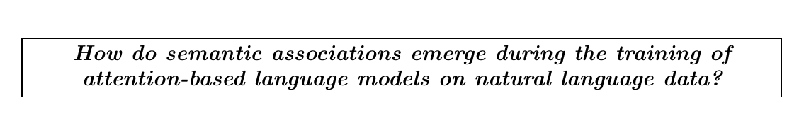
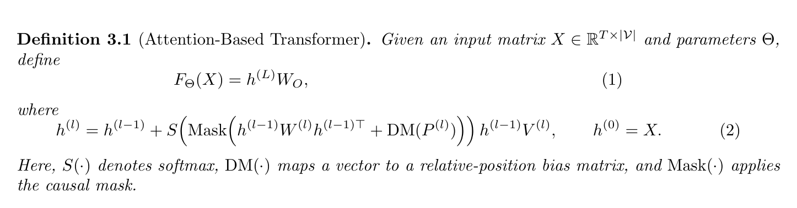
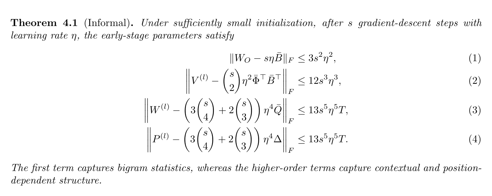
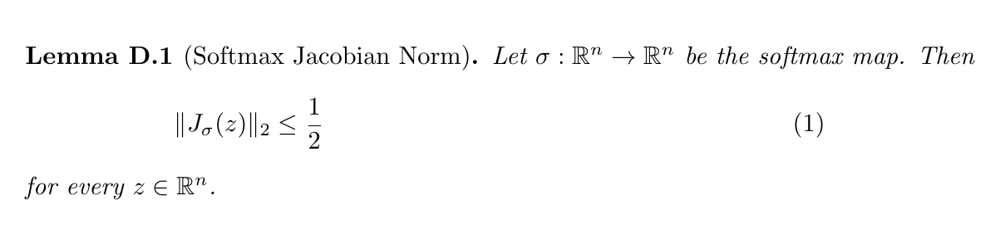
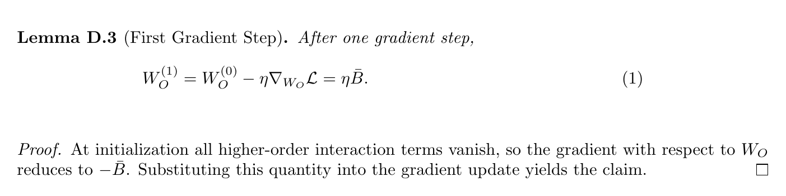
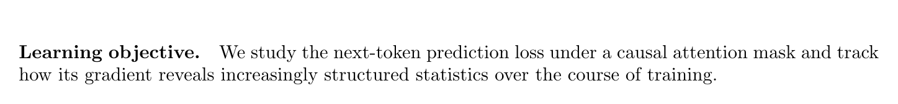
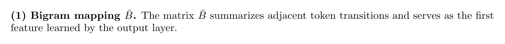
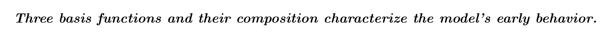
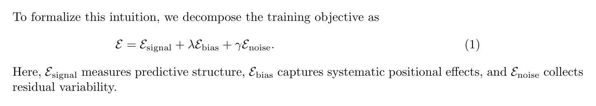
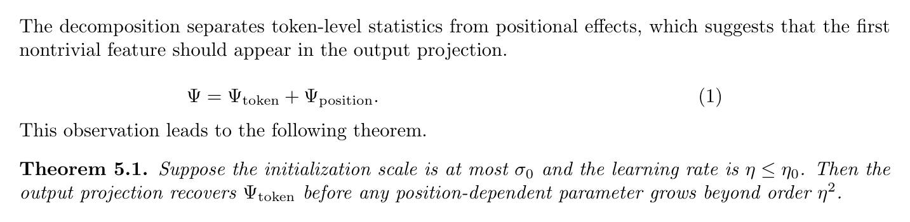

# 机器学习理论论文 LaTeX 通用素材库

这是一组可以直接复制到机器学习理论论文里的 LaTeX 写作素材。

它不是完整论文模板，而是更小粒度的“句式 + 环境 + 排版”片段，适合在写 introduction、definition、theorem、lemma、proof 和公式解释时快速复用。

使用时建议先关注三件事：

1. **先明确功能**：这个片段是用来提出问题、定义对象、陈述结论，还是解释公式。
2. **再替换符号**：保留叙述结构，把变量、矩阵、误差项替换成自己的对象。
3. **最后统一风格**：同一篇论文里的 theorem、lemma、proof 和强调框要保持一致。

> 说明：下方每个小节都包含源码和编译预览。`\questionbox`、`\Mask`、`\DM` 等命令是示例中的自定义宏，实际使用时可以换成你论文里的宏定义。

---

## 素材总览

| 编号 | 类型 | 适合场景 |
| --- | --- | --- |
| 01 | 强调性研究问题 | 引言末尾、problem statement |
| 02 | 定义环境 | 定义模型、对象、递推结构 |
| 03 | 主结果定理 | 陈述核心上界、分解结论、阶段性结论 |
| 04 | 短引理 | 证明链中的局部工具结论 |
| 05 | 引理与证明 | 用 2--3 句说明关键因果链 |
| 06 | 行内小标题 | 在一节内部切换叙述焦点 |
| 07 | 编号式加粗说明 | 拆解 theorem 或公式中的多个成分 |
| 08 | 粗斜体强调句 | 段首总结机制或核心观察 |
| 09 | 公式后立即解释 | 先给公式，再解释每个符号的功能 |
| 10 | 由公式过渡到定理 | 公式、直觉解释、theorem 的自然衔接 |

---

## 01. Boxed question / 强调性研究问题

用于把核心研究问题单独拎出来，形成视觉停顿。适合引言末尾或 problem statement。

```latex
\questionbox{How do semantic associations emerge during the training of attention-based language models on natural language data?}
```



---

## 02. Definition + displayed equations / 定义环境

先定义对象，再给递推公式，最后补符号解释。是理论论文中很常见的定义写法。

```latex
\begin{definition}[Attention-Based Transformer]
Given an input matrix $X \in \mathbb{R}^{T \times |\mathcal V|}$ and parameters $\Theta$, define
\begin{equation}
F_{\Theta}(X)=h^{(L)}W_O,
\end{equation}
where
\begin{equation}
h^{(l)} = h^{(l-1)} +
S\!\left(\Mask\!\left(h^{(l-1)}W^{(l)}h^{(l-1)\top} + \DM(P^{(l)})\right)\right)
h^{(l-1)}V^{(l)},
\qquad
h^{(0)} = X.
\end{equation}
Here, $S(\cdot)$ denotes softmax, $\DM(\cdot)$ maps a vector to a relative-position bias matrix, and $\Mask(\cdot)$ applies the causal mask.
\end{definition}
```



---

## 03. Theorem + align / 主结果定理

把主结果压缩为并列不等式组，再用一句话解释各项含义。适合 early-stage training、误差上界、分解结论等场景。

```latex
\begin{theorem}[Informal]
Under sufficiently small initialization, after $s$ gradient-descent steps with learning rate $\eta$, the early-stage parameters satisfy
\begin{align}
\|W_O - s\eta \bar B\|_F &\le 3 s^2 \eta^2, \\
\left\|V^{(l)} - \binom{s}{2}\eta^2 \bar\Phi^\top \bar B^\top\right\|_F &\le 12 s^3 \eta^3, \\
\left\|W^{(l)} - \left(3\binom{s}{4}+2\binom{s}{3}\right)\eta^4 \bar Q\right\|_F &\le 13 s^5 \eta^5 T, \\
\left\|P^{(l)} - \left(3\binom{s}{4}+2\binom{s}{3}\right)\eta^4 \Delta\right\|_F &\le 13 s^5 \eta^5 T.
\end{align}
The first term captures bigram statistics, whereas the higher-order terms capture contextual and position-dependent structure.
\end{theorem}
```



---

## 04. Short lemma / 短引理

短引理适合证明链里的技术步骤：先给一条局部可复用结论，后续在 theorem proof 中调用。

```latex
\begin{lemma}[Softmax Jacobian Norm]
Let $\sigma:\mathbb{R}^n \to \mathbb{R}^n$ be the softmax map. Then
\begin{equation}
\|J_{\sigma}(z)\|_2 \le \frac{1}{2}
\end{equation}
for every $z \in \mathbb{R}^n$.
\end{lemma}
```



---

## 05. Lemma + proof / 引理与证明

展示最常见的 proof 节奏：先写 lemma，再用 2--3 句证明核心因果链，而不是一上来堆细节。

```latex
\begin{lemma}[First Gradient Step]
After one gradient step,
\begin{equation}
W_O^{(1)} = W_O^{(0)} - \eta \nabla_{W_O}\mathcal L = \eta \bar B.
\end{equation}
\end{lemma}

\begin{proof}
At initialization all higher-order interaction terms vanish, so the gradient with respect to $W_O$ reduces to $-\bar B$. Substituting this quantity into the gradient update yields the claim.
\end{proof}
```



---

## 06. Run-in paragraph heading / 行内小标题

适合在一节内部快速切换叙述焦点，不必新开 subsection。视觉上轻，但逻辑上很清楚。

```latex
\paragraph{Learning objective.}
We study the next-token prediction loss under a causal attention mask and track how its gradient reveals increasingly structured statistics over the course of training.
```



---

## 07. Numbered inline item / 编号式加粗说明

适合拆解 theorem 中的多个成分：每一项先给标签，再给一句功能说明。

```latex
\noindent\textbf{(1) Bigram mapping $\bar B$.}
The matrix $\bar B$ summarizes adjacent token transitions and serves as the first feature learned by the output layer.
```



---

## 08. Bold-italic emphasis / 粗斜体强调句

适合作为段首提示语，强调接下来不是纯推导，而是机制解释或结论总括。

```latex
\noindent\textbf{\textit{Three basis functions and their composition characterize the model's early behavior.}}
```



---

## 09. Formula + immediate explanation / 公式后立即解释

这是“先给公式，再逐项解释符号功能”的标准写法。对读者最友好，也最容易迁移到自己的论文里。

```latex
To formalize this intuition, we decompose the training objective as
\begin{equation}
\mathcal E = \mathcal E_{\mathrm{signal}} + \lambda \mathcal E_{\mathrm{bias}} + \gamma \mathcal E_{\mathrm{noise}}.
\end{equation}
Here, $\mathcal E_{\mathrm{signal}}$ measures predictive structure, $\mathcal E_{\mathrm{bias}}$ captures systematic positional effects, and $\mathcal E_{\mathrm{noise}}$ collects residual variability.
```



---

## 10. From decomposition to theorem / 由公式过渡到定理

展示“公式 -> 直觉解释 -> theorem”的自然过渡，特别适合理论论文正文主线。

```latex
The decomposition separates token-level statistics from positional effects, which suggests that the first nontrivial feature should appear in the output projection.

\begin{equation}
\Psi = \Psi_{\mathrm{token}} + \Psi_{\mathrm{position}}.
\end{equation}

This observation leads to the following theorem.

\begin{theorem}
Suppose the initialization scale is at most $\sigma_0$ and the learning rate is $\eta \le \eta_0$. Then the output projection recovers $\Psi_{\mathrm{token}}$ before any position-dependent parameter grows beyond order $\eta^2$.
\end{theorem}
```



---

## 最后

这组素材最适合当作写作时的“结构参考”：

- 写引言时，用 boxed question 把问题拎出来。
- 写正文时，用 definition 和 theorem 先固定对象与主结果。
- 写证明时，用 lemma 把技术步骤拆开。
- 写公式时，不只展示推导，还要立刻解释每一项在做什么。

好的理论论文不只是公式正确，还要让读者看清楚：问题是什么、对象是什么、结论靠什么成立，以及每一步推导在整条论证链里承担什么功能。

---

## 追加：Transformer 理论论文写作指南

这一部分整理自一份更完整的 Transformer 理论论文写作指南。它不再提供单个 LaTeX 片段，而是把片段上升为“论文级写作模式”：如何提出 gap、如何描述公式、如何把 theorem 接回模型机制与实验验证。

### 三类 Transformer 理论论文写法

| 类型 | 典型问题 | 写作重心 | 常见结构 |
| --- | --- | --- | --- |
| 表达能力 / 复杂度论文 | Transformer 能否更 succinct 地表示某类结构？ | 定义对象、构造例子、给出 theorem / proposition / proof sketch | prose definition → example → theorem → proof sketch |
| 训练动力学 / 机制解释论文 | 训练早期参数如何学到 token association？ | 定义模型、写出目标函数、展开 leading term、解释 theorem | definition → objective → update → informal theorem → interpretation |
| 数值精度 / 训练失效论文 | low precision 为什么导致训练不稳定？ | 先定位故障，再用公式解释误差传播，并用实验验证 | notation → claim → derivation → remark → validation |

这三类论文的共性是：**数学结果不是孤立出现的，而是嵌在一条叙述链里。**

```text
gap → object → formula → interpretation → theorem / claim → validation
```

如果只写公式，不写它在这条链里的位置，读者会很难判断它为什么重要。

---

## 公式描述的 5 种模式

理论论文里的公式，最好不要“裸奔”。一个关键公式前后，通常需要下面几类文字配合。

### 1. 预告型公式描述

**作用**：先告诉读者这条公式要解决什么问题。

常用句式：

```text
To formalize this intuition, we define ...
We now express this quantity as ...
To understand how the error propagates, we analyze ...
The following decomposition separates ... into ...
```

可迁移模板：

```latex
Motivated by the discrepancy observed above, we express the error term as
\begin{equation}
E_t = \alpha\,\mathrm{diag}(\delta_t)\,K_t.
\end{equation}
```

### 2. 符号解释型公式描述

**作用**：公式后立即解释每个符号和每一项的角色。

常用句式：

```text
Here, ... denotes ..., while ... represents ...
The first term captures ..., whereas the second term accounts for ...
where ||·||_F is ..., and B corresponds to ...
```

可迁移模板：

```latex
Here, $\Psi$ denotes the context-summary statistic, while $B$ represents the local next-token mapping.
The product $\Psi^\top B^\top$ therefore combines long-range context aggregation with local predictive structure.
```

### 3. 直觉解释型公式描述

**作用**：不只解释“每一项是什么”，还解释“为什么这样写是合理的”。

常用句式：

```text
Intuitively, this term increases when ...
In essence, Eq. (...) shows that ...
This expression reveals that ... is governed by ...
The asymmetry comes from ...
```

可迁移模板：

```latex
Intuitively, the statistic grows when the token is repeatedly observed in similar prefix environments,
since both the local and contextual factors reinforce one another.
```

### 4. 分解型公式描述

**作用**：把复杂公式拆成多个组件，分别解释后再组合。

常用句式：

```text
The decomposition consists of three components: ...
We walk through the construction in three steps.
The term ... corresponds to ..., while ... corresponds to ...
```

可迁移模板：

```latex
We decompose the score into three parts:
\begin{align}
S &= S_{\text{local}} + S_{\text{context}} + S_{\text{position}},\\
S_{\text{local}} &= XBX^\top, \qquad
S_{\text{context}} = X\Psi^\top B^\top.
\end{align}
The first term captures immediate transitions, whereas the second term aggregates smoothed contextual evidence.
```

### 5. 结论过渡型公式描述

**作用**：把公式自然引到 theorem、claim 或 experiment。

常用句式：

```text
This observation leads to the following theorem.
Based on this characterization, we obtain ...
We validate this prediction empirically in Section ...
This decomposition suggests ..., which we formalize below.
```

可迁移模板：

```latex
This decomposition suggests a signed accumulation effect.
We formalize this below and validate it with targeted ablations in Section 4.
```

---

## 一个关键公式的推荐顺序

如果一条公式很重要，它几乎总应该按照下面的顺序出现：

```text
1. 动机句：为什么需要这条公式
2. 公式：用 equation 或 align 给出对象
3. 符号解释：每个符号在做什么
4. 直觉说明：为什么这个量合理
5. 过渡句：引到 theorem / claim / experiment
```

对应的 LaTeX 骨架：

```latex
\paragraph{Motivation.}
To formalize the contextual dependence discussed above, we introduce a corpus statistic that aggregates prefix evidence.

\begin{equation}
\Psi_{ij} = \cdots
\end{equation}

Here, $\Psi_{ij}$ denotes ..., while $\mu_j$ acts as a centering term.
Intuitively, the statistic is large when token $e_j$ appears repeatedly in the contexts of $e_i$.

This characterization allows us to express the leading term of the value matrix as $\Psi^\top B^\top$,
which leads to the following theorem.
```

---

## 章节级模板

一篇“理论 + 机制解释”型机器学习论文，可以按下面的顺序组织：

1. **Introduction：先提出错位，再提出问题**  
   不要只说“这个问题很重要”，而要说明“现有理论为什么不足以解释这个现象”。

2. **Setup / Notation：给所有核心量找锚点**  
   如果一个量会在 theorem 中反复出现，就应在前文被定义、命名并编号。

3. **Main Characterization：先给局部对象，再给全局结论**  
   先定义统计量、映射或误差项，再写 theorem / claim。

4. **Interpretation：theorem 后必须解释意义**  
   至少回答：这个结论意味着什么？它和 Transformer / attention / LLM 行为有什么关系？

5. **Mechanism / Proof Sketch：主文保留证明路线**  
   技术细节可以放附录，但主文要保留 proof sketch、图示或关键因果链。

6. **Experiments：实验写成 verification**  
   图表最好直接对应 theorem / claim 中的变量、方向或预测。

7. **Appendix：放完整证明和长细节**  
   完整证明、技术引理、次要实验、长算法细节放到附录。

---

## 常用英文句式

| 功能 | 句式 |
| --- | --- |
| 提出 gap | Despite recent progress on ..., we still lack a principled account of ... |
| 把现实问题转成数学对象 | To study this mechanism formally, we introduce ... |
| 引入 notation | We begin by introducing the notation needed to define ... |
| 第一次出现复杂公式 | We now express this quantity as ... |
| 解释符号 | Here, ... denotes ..., while ... represents ... |
| 解释直觉 | Intuitively, this term increases when ... |
| 分解公式 | The decomposition consists of three components: ... |
| 引出 theorem | This observation leads to the following theorem. |
| theorem 后解释意义 | The above theorem shows that ... |
| 连接实验 | We validate this prediction empirically in Section ... |
| 说明主文 / 附录分工 | The formal statement and proofs are deferred to Appendix ... |

---

## 最小可复用导言区

适合中文或中英混排的理论 / 机制解释论文：

```latex
\documentclass[11pt,a4paper]{ctexart}
\usepackage[margin=1in]{geometry}
\usepackage{amsmath,amssymb,amsthm,mathtools,bm}
\usepackage{graphicx,booktabs,tabularx}
\usepackage{hyperref}
\usepackage{caption,subcaption}
\usepackage{listings}
\usepackage[most]{tcolorbox}
\usepackage[numbers]{natbib}

\newtheorem{theorem}{Theorem}[section]
\newtheorem{definition}[theorem]{Definition}
\newtheorem{lemma}[theorem]{Lemma}
```

---

## 最小 theorem 单元模板

```latex
\paragraph{Motivation.}
To formalize the intuition above, we define ...

\begin{equation}
...
\end{equation}

Here, ... denotes ..., while ... represents ...

\begin{theorem}[Informal]
...
\end{theorem}

\paragraph{Interpretation.}
The theorem shows that ...
```

---

## 最小机制分析单元模板

```latex
\paragraph{Localizing the failure.}
We first identify the unstable intermediate quantity ...

\begin{tcolorbox}[title=Claim]
...
\end{tcolorbox}

\begin{align}
...
\end{align}

This derivation shows that the update error is governed by ...

We validate this mechanism by ...
```

---

## 写作检查清单

### 结构检查

- 是否明确提出了一个“旧尺度不足 / 旧设置不真实 / 旧方法缺机理”的 gap？
- main theorem 之前是否已经引入所有核心记号？
- theorem 后是否有解释段，而不是只有 proof？
- 主文是否保留了 proof sketch 或路线图？

### 公式检查

- 第一条复杂公式前是否有动机句？
- 每个关键公式后是否有 `Here, ... denotes ...`？
- 是否有 `Intuitively, ...` 或 `This shows that ...` 的直觉解释？
- 多步推导是否用 `align` 暴露逻辑骨架？
- 是否避免在 theorem 中第一次塞入过多新符号？

### 理论--实验闭环检查

- 实验是否直接对应 theorem / claim 中的变量？
- 图注是否说明图在验证什么？
- 是否明确说明理论适用范围，如早期训练、小学习率、局部条件？
- 是否把数学结果重新翻译回 Transformer / attention / LLM 的实际含义？

---

## 最实用的一条经验

如果一条公式在论文里很重要，它几乎总应当伴随三样东西一起出现：

1. **预告句**：告诉读者这条公式要解决什么问题。
2. **符号解释**：告诉读者每个符号在做什么。
3. **直觉说明**：告诉读者为什么这个式子合理。

缺少其中任何一项，读者的理解成本都会明显上升。
