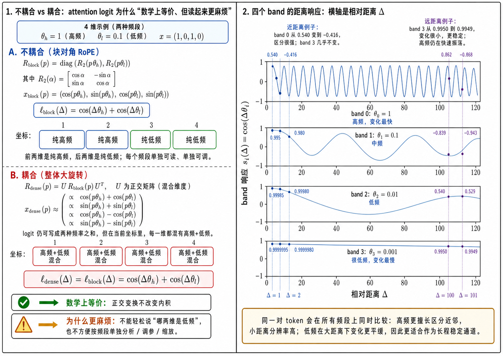
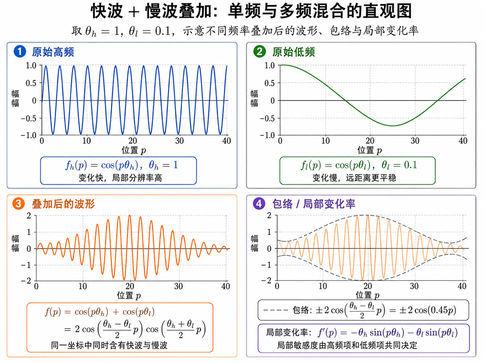

# RoPE（旋转位置编码）讲义：从问题到工程实践

> 一份围绕 RoPE（Rotary Position Embedding）的系统讲义：从它要解决的位置编码问题出发，一路拆到二维旋转、相对位移、attention logit、关键引理、结构性结论与长上下文工程实践。

<iframe src="/pdf/rope-lecture.pdf" width="100%" height="800px" style="border: 1px solid #e0e0e0; border-radius: 8px;"></iframe>

📥 [下载 PDF](/pdf/rope-lecture.pdf)

---

## 这份讲义在讲什么

RoPE 不是简单地“把位置向量加到 token 上”。它的核心做法是：

> 把单个 attention head 的通道按二维一组拆开，在每一组上做与位置成正比的旋转，让 query 和 key 的内积自然带上相对位移的相位差。

因此，位置依赖不是作为绝对位置向量直接混入输入，而是以“相位差”的形式进入注意力打分。

这份讲义沿着下面这条路线展开：

```text
问题 → 对象 → 约束 → 坐标系 → 例子 / 反例 → 形式定义 → 引理 → 定理 → 工程实践
```

---

## 补充：RoPE 的多尺度相位基底

RoPE 不是在给单个 token 建模“内部复杂关系”，而是在给每个 token 的 `q / k` 表示提供一个多尺度相位基底。这样，之后任意两个位置做 attention 内积时，模型可以在多种尺度上表达相对位移。

换句话说：

> 单个 token 需要携带足够丰富的“位置比较工具箱”。

RoPE 选择“每两维一组”，不是偶然的。二维旋转是实数空间里最简单、最自然、最省参数、又能保持相对位移结构的基本单位；更高维旋转要么更复杂，要么本质上仍然可以分解成多个二维旋转。

只有一个整体频率并不够，因为它只能提供单一尺度的位置响应。多频率 RoPE 的意义不是“哪个 token 用高频、哪个 token 用低频”，而是同一对 token 的相对距离会被所有 band 同时测量：高频像短尺子，擅长分清近处小差别；低频像长尺子，擅长给远处提供平滑坐标。

一个 head 的位置部分可以粗略看成一条距离响应函数：

$$
\ell_h(\Delta)=\sum_i \ell_i(\Delta)=\sum_i \big[a_i\cos(\Delta\theta_i)+b_i\sin(\Delta\theta_i)\big].
$$

最后虽然会加成一个标量 `\ell_h(\Delta)`，但“加总”不等于“没区别”。高频和低频不是要保留成多个独立输出通道，而是作为多组基函数共同塑造这个 head 的距离偏好曲线：高频提供快速起伏，让 `Δ=-1`、`Δ=-2`、`Δ=-3` 这类近邻偏移更容易被拉开；低频提供缓慢变化的背景，让大位移范围内的响应更平滑。



上图左侧说明了一个关键点：块对角 RoPE 与整体稠密旋转在某些内积结果上可以数学等价，但读起来、调起来并不等价。块对角结构让“哪两维对应哪个频率”保持清楚；稠密耦合虽然可能保留总内积，却会把高频和低频混在每个坐标里，使单独分析、缩放、插值都更麻烦。

右侧展示了不同频率 band 对相对距离 `Δ` 的响应：同一对 token 会在所有频段上同时比较，高频更擅长区分近邻，小距离分辨率高；低频在大距离下变化更平缓，因此更适合作为长程稳定通道。多 band 的价值不在于让单个 token 内部更复杂，而在于给任意 token-pair 的比较提供多尺度相位坐标。



这张图可以理解为多频率 RoPE 的直觉版：快波提供局部敏感性，慢波提供长程包络。叠加之后，attention 可以同时拥有“近处分得开”和“远处不至于完全失控”的位置比较能力。这里的“能分近邻”不是说近邻一定分数更高，而是说当两个候选位置内容相近时，位置项能让 `Δ=-1` 和 `Δ=-2` 这样的细小相对位移在最终 attention logit 里被明显区分，而不是几乎一样。

---

## 目录概览

| 章节 | 内容 |
| --- | --- |
| 第 1 章 | **问题**：RoPE 要解决什么问题；为什么需要从绝对位置走向相对位置 |
| 第 2 章 | **对象**：位置 `p`、注意力里的 `q / k` 向量、内积和 token-pair 比较关系 |
| 第 3 章 | **核心问题**：如何让位置进入 attention，并让打分依赖相对位移 |
| 第 4 章 | **自由度**：频率表、head 维度、band 划分、上下文缩放以及作用对象 |
| 第 5 章 | **约束**：长度保持、相对位移进入比较关系、计算复杂度与 attention 流水线兼容 |
| 第 6 章 | **坐标系**：绝对 / 相对位置，加法型 / 几何变换型，单尺度 / 多尺度 |
| 第 7 章 | **例子**：单 band 二维旋转、多 band RoPE、scaled RoPE、近远距离数值例子 |
| 第 8 章 | **反例**：learned absolute position embedding、单一频率旋转、高维稠密旋转 |
| 第 9 章 | **核心图景**：小表盘、相位差与多尺度位置感知 |
| 第 10 章 | **形式定义**：二维旋转矩阵、block-diagonal RoPE、相对位移进入 attention 的公式 |
| 第 11 章 | **基本操作**：构造频率表、位置到相位映射、head 二维分解、长上下文扩展 |
| 第 12 章 | **关键引理**：旋转内积相减性质、长度保持、多 band 多尺度表示 |
| 第 13 章 | **核心定理**：相对位移表示、多尺度表示、二维分解、正交不变量 |
| 第 14 章 | **评价标准**：什么算好、坏、深刻、无效，以及工程评价维度 |
| 第 15 章 | **流派争论**：RoPE 与其他位置编码、原始 RoPE 与 scaled RoPE |
| 第 16 章 | **应用迁移**：语言模型、代码模型、视觉 / 多模态、时间序列与失效条件 |
| 第 17 章 | **训练闭环**：能否预测、举例、反驳、证明、应用和教给别人 |
| 第 18 章 | **总结**：RoPE 的一句话本质、数学核心、工程核心与后续主题 |

---

## 适合怎么读

如果你只想快速建立直觉，可以先读：

- 第 1 章：RoPE 要解决什么问题
- 第 7 章：单 band 和多 band 的具体例子
- 第 9 章：小表盘与相位差图景
- 第 18 章：一句话本质与总结

如果你想把公式真正吃透，可以重点读：

- 第 10 章：形式定义
- 第 12 章：关键引理
- 第 13 章：结构性结论
- 附录 A：单 band 公式的一次性原子项展开

如果你关心工程实践，可以直接跳到：

- 第 4 章：频率表、head 维度和上下文缩放
- 第 11 章：频率缩放、插值与长上下文扩展
- 第 14 章：工程评价维度
- 第 16 章：应用迁移与失效条件

---

## 一句话总结

> RoPE 的本质，是把“位置差”变成 query-key 比较中的“相位差”，用二维旋转把相对位置自然嵌入 attention logit。
