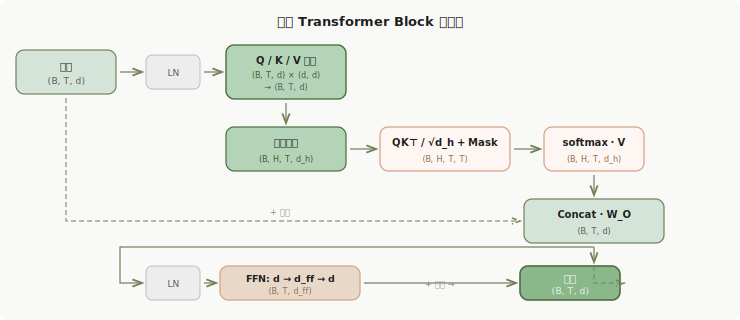
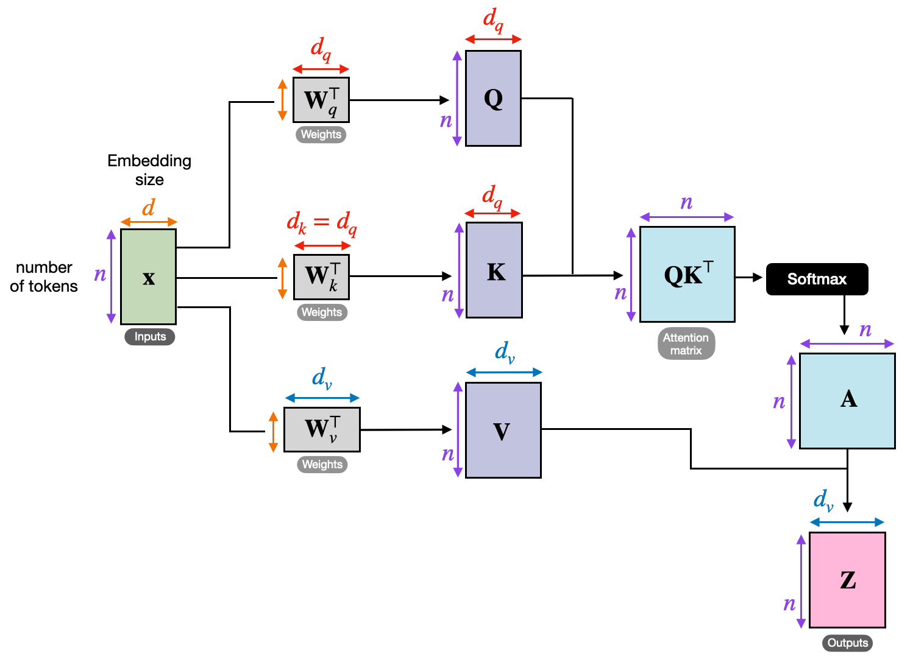
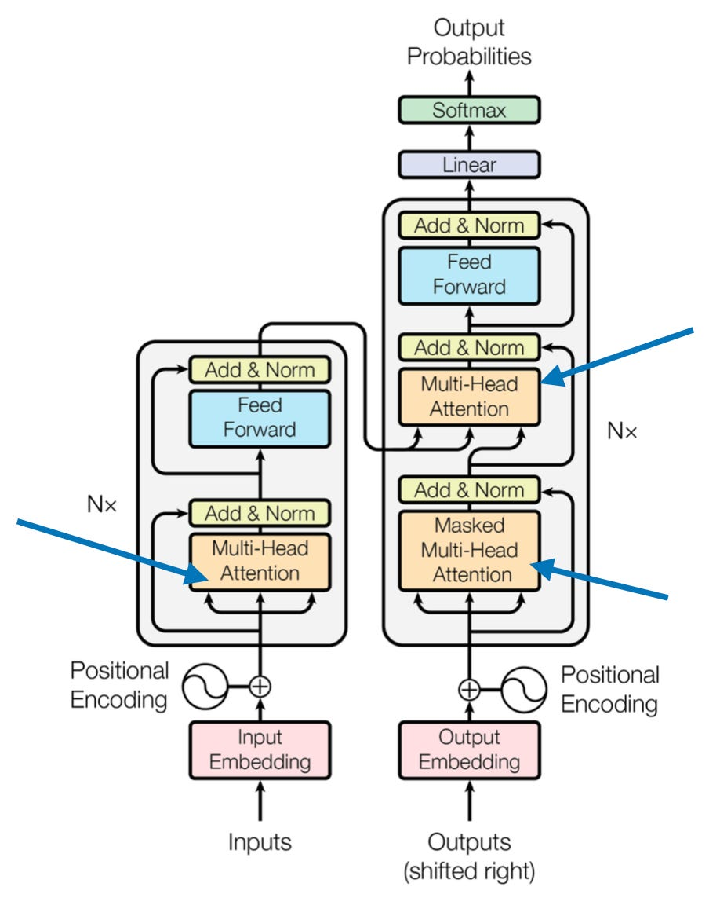
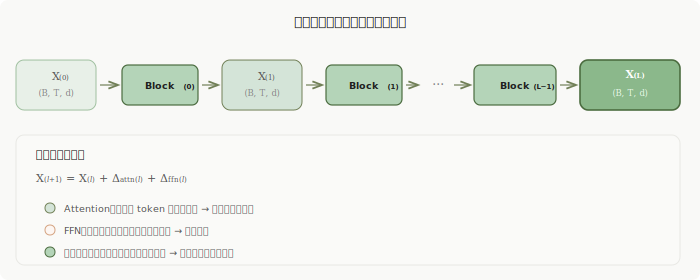

> **把 Transformer 每一步的矩阵维度写出来，层与层之间传递的到底是什么就会变得非常清楚。**

这篇文章的目的是：用 **矩阵维度** 作为主线，完整追踪一个 token 从输入到最终 logits 的全过程。每一步都标注 shape 变化，不跳步骤。

如果你对 Transformer 在 Agent 中的控制状态感兴趣，可以配合这篇一起看：

- [Transformer 的持续控制状态：KV Cache 与残差流如何塑造 Agent 决策](/blog/transformer-persistent-control-state/)

以下所有推导基于 **decoder-only / GPT 风格**的 Pre-LN Transformer，这也是目前主流大模型（GPT、LLaMA、Qwen 等）的标准结构。部分图示参考了原始 Transformer 论文 [^1] 以及 Sebastian Raschka 的 self-attention 教程 [^2]。

---

## 一、符号约定

| 符号 | 含义 | 典型值 |
| --- | --- | --- |
| $B$ | batch size | 2 |
| $T$ | 序列长度 | 128 |
| $d$ | hidden size | 768 |
| $H$ | 注意力头数 | 12 |
| $d_h$ | 每头维度，$d_h = d / H$ | 64 |
| $L$ | 层数 | 12 / 24 |
| $d_{ff}$ | FFN 中间维度 | 3072 |
| $V$ | 词表大小 | 32000+ |

---

## 二、输入层：token id → embedding

### 2.1 Token Embedding

输入是一组整数索引：

$$
\text{input\_ids} \in \mathbb{Z}^{B \times T}
$$

词向量矩阵：

$$
W_E \in \mathbb{R}^{V \times d}
$$

查表得到：

$$
X_{\text{tok}} \in \mathbb{R}^{B \times T \times d}
$$

### 2.2 Position Embedding

位置编码矩阵（可学习或 RoPE）：

$$
W_P \in \mathbb{R}^{T_{\max} \times d}
$$

取前 $T$ 个位置，broadcast 到 batch 维：

$$
X_{\text{pos}} \in \mathbb{R}^{B \times T \times d}
$$

### 2.3 第 0 层输入

$$
X^{(0)} = X_{\text{tok}} + X_{\text{pos}} \in \mathbb{R}^{B \times T \times d}
$$

这就是送入第一个 Transformer block 的输入。

---

## 三、单层结构：Pre-LN 的 Attention + FFN

现代大模型普遍采用 **Pre-LN** 结构。一层的紧凑写法：

$$
\hat{X}^{(l)} = \mathrm{LN}(X^{(l)})
$$

$$
Y^{(l)} = X^{(l)} + \mathrm{MHA}(\hat{X}^{(l)})
$$

$$
\tilde{Y}^{(l)} = \mathrm{LN}(Y^{(l)})
$$

$$
X^{(l+1)} = Y^{(l)} + \mathrm{FFN}(\tilde{Y}^{(l)})
$$

其中每一步的 shape 都是 $\mathbb{R}^{B \times T \times d}$——**输入和输出维度相同**，这是 Transformer 能任意堆叠的关键。

---

## 四、Attention 子层：完整维度推导

下图展示了单个 attention head 的完整计算流水线（图源 [^2]）：

核心三步：输入 $X$ 经过 $W_Q, W_K, W_V$ 投影得到 Query / Key / Value，通过点积计算注意力权重，再加权求和 Value 得到输出。

在实际模型中，多个 head 并行执行上述流程，最后拼接。下图是原始 Transformer 论文 [^1] 中的多头注意力架构：

每个 head 学习不同的关系模式——有的偏局部邻近，有的偏语法依赖，有的偏长距离引用。下面逐步追踪维度变化。

### 4.1 LayerNorm

$$
\hat{X}^{(l)} = \mathrm{LN}(X^{(l)}) \in \mathbb{R}^{B \times T \times d}
$$

对每个 token 的特征维做归一化，维度不变。

### 4.2 Q / K / V 投影

每层有三组投影矩阵：

$$
W_Q^{(l)},\; W_K^{(l)},\; W_V^{(l)} \in \mathbb{R}^{d \times d}
$$

线性投影：

$$
Q = \hat{X}^{(l)} W_Q^{(l)},\quad K = \hat{X}^{(l)} W_K^{(l)},\quad V = \hat{X}^{(l)} W_V^{(l)}
$$

$$
Q, K, V \in \mathbb{R}^{B \times T \times d}
$$

### 4.3 拆成多头

因为 $d = H \cdot d_h$，把最后一维拆开并转置：

$$
Q \to \mathbb{R}^{B \times T \times H \times d_h} \to \mathbb{R}^{B \times H \times T \times d_h}
$$

同理：

$$
K, V \in \mathbb{R}^{B \times H \times T \times d_h}
$$

### 4.4 计算 attention score

每个 head 内做矩阵乘法（在最后两维）：

$$
S = \frac{Q K^\top}{\sqrt{d_h}}
$$

- $Q$: $(T \times d_h)$
- $K^\top$: $(d_h \times T)$

$$
S \in \mathbb{R}^{B \times H \times T \times T}
$$

含义：对 batch 中每个样本、每个 head、每个 query 位置，都得到对全部 key 位置的相关性打分。

### 4.5 加 causal mask

decoder-only 模型需要因果 mask，禁止看未来 token：

$$
M \in \mathbb{R}^{1 \times 1 \times T \times T}
$$

$$
S' = S + M \in \mathbb{R}^{B \times H \times T \times T}
$$

上三角部分被置为 $-\infty$，softmax 后这些位置的权重变为 0。这是 **pre-softmax masking**——因为 $e^{-\infty} \approx 0$，softmax 自然会把被 mask 的位置归零，无需额外的归一化步骤 [^2]。

另一种做法是 **post-softmax masking**（先 softmax 再置零再归一化），但 pre-softmax 更高效，也是主流实现。

### 4.6 softmax → 注意力权重

$$
A = \mathrm{softmax}(S',\; \text{dim}=-1) \in \mathbb{R}^{B \times H \times T \times T}
$$

每个 query 位置对所有可见历史位置的权重和为 1。

之所以要除以 $\sqrt{d_h}$（scaled dot-product），是因为当 $d_h$ 较大时，$QK^\top$ 的方差会随维度线性增长，导致 softmax 输出趋向 one-hot，梯度几乎消失。除以 $\sqrt{d_h}$ 可以将方差控制在稳定范围内 [^1][^2]。

### 4.7 加权求和 V

$$
O_{\text{head}} = A \cdot V
$$

- $A$: $(T \times T)$
- $V$: $(T \times d_h)$

$$
O_{\text{head}} \in \mathbb{R}^{B \times H \times T \times d_h}
$$

### 4.8 拼接各头 + 输出投影

转回 $(B, T, H, d_h)$，reshape 为 $(B, T, H \cdot d_h) = (B, T, d)$：

$$
O_{\text{cat}} \in \mathbb{R}^{B \times T \times d}
$$

输出投影矩阵 $W_O^{(l)} \in \mathbb{R}^{d \times d}$：

$$
O_{\text{attn}} = O_{\text{cat}} \cdot W_O^{(l)} \in \mathbb{R}^{B \times T \times d}
$$

### 4.9 残差连接

$$
Y^{(l)} = X^{(l)} + O_{\text{attn}} \in \mathbb{R}^{B \times T \times d}
$$

---

## 五、FFN 子层：升维与降维

先做 LayerNorm：

$$
\tilde{Y}^{(l)} = \mathrm{LN}(Y^{(l)}) \in \mathbb{R}^{B \times T \times d}
$$

### 5.1 第一层线性：升维

$$
W_1^{(l)} \in \mathbb{R}^{d \times d_{ff}}
$$

$$
Z = \tilde{Y}^{(l)} W_1^{(l)} + b_1 \in \mathbb{R}^{B \times T \times d_{ff}}
$$

### 5.2 激活函数

$$
G = \mathrm{GELU}(Z) \in \mathbb{R}^{B \times T \times d_{ff}}
$$

现代模型常用 SwiGLU / GEGLU 等门控变体。

### 5.3 第二层线性：降回 hidden size

$$
W_2^{(l)} \in \mathbb{R}^{d_{ff} \times d}
$$

$$
O_{\text{ffn}} = G \cdot W_2^{(l)} + b_2 \in \mathbb{R}^{B \times T \times d}
$$

### 5.4 残差连接

$$
X^{(l+1)} = Y^{(l)} + O_{\text{ffn}} \in \mathbb{R}^{B \times T \times d}
$$

---

## 六、多层堆叠：维度不变，表示逐层演化

$$
X^{(0)} \xrightarrow{\text{Block}^{(0)}} X^{(1)} \xrightarrow{\text{Block}^{(1)}} X^{(2)} \xrightarrow{\cdots} X^{(L)}
$$

每一层输入输出都是 $\mathbb{R}^{B \times T \times d}$，可以无缝堆叠任意多层。

紧凑写法：

$$
X^{(L)} = \mathrm{Block}^{(L-1)} \circ \cdots \circ \mathrm{Block}^{(0)}(X^{(0)})
$$

每层结构相同，但**参数独立**：

$$
\theta^{(l)} = \{W_Q^{(l)}, W_K^{(l)}, W_V^{(l)}, W_O^{(l)}, W_1^{(l)}, W_2^{(l)}, \ldots\}
$$

---

## 七、最后一层之后：从 hidden state 到 logits

最后一层输出再做一次 LayerNorm：

$$
H = \mathrm{LN}(X^{(L)}) \in \mathbb{R}^{B \times T \times d}
$$

然后映射到词表空间：

$$
W_{\text{lm}} \in \mathbb{R}^{d \times V}
$$

$$
\text{logits} = H \cdot W_{\text{lm}} \in \mathbb{R}^{B \times T \times V}
$$

每个 batch 样本、每个时间步，对词表中每个 token 都有一个预测分数。

---

## 八、残差的真正作用：增量叠加

残差连接让每层学的是"增量修正"：

$$
X^{(l+1)} = X^{(l)} + \Delta^{(l)}
$$

这有三个关键效果：

1. **梯度更容易传播**：反向传播时梯度可以沿残差连接直接流向浅层，不会被中间层的非线性"吃掉"
2. **原始信息不会丢**：底层编码的 token 身份、位置信息会被一路保留
3. **深层训练更稳定**：每层只需要学"补充什么"，而非"从零重造什么"

所以多层 Transformer 更像逐层加注释：

$$
\text{原始 token 身份} \to +\text{局部依赖} \to +\text{语义约束} \to +\text{篇章关系} \to +\text{任务特征}
$$

---

## 九、逐层抽象是怎么形成的

单层 Attention 已经可以"看到全局"——每个 query 都会扫描所有历史 key。但**"看到全局"不等于"一步就提取出复杂抽象"**。

逐层抽象的形成机制：

1. **第 $l$ 层的 Attention 读到的 K/V，来自第 $l$ 层的 hidden state**。这些 hidden state 已经经过了前面 $l$ 层的上下文化处理。
2. 所以第 1 层读到的是**原始词向量附近的信息**，第 8 层读到的是**已带局部上下文的表示**，第 22 层读到的是**已经压入复杂组合关系的表示**。
3. 每层的 FFN 再对 Attention 聚合后的结果做非线性重编码，把"混合信息"压成更适合表达高阶特征的方向。

所以常见的逐层特征演进是：

$$
\text{词级特征} \to \text{短语关系} \to \text{句子语义} \to \text{跨句推理}
$$

注意：这个过程的驱动力是 **Attention 的反复聚合 + FFN 的非线性变换**，残差只是保证这些新特征能在旧表示上稳定叠加。

---

## 十、三个最容易混淆的矩阵维度

### 主干隐藏状态

$$
X^{(l)} \in \mathbb{R}^{B \times T \times d}
$$

这是层与层之间真正传递的东西。

### 每头的 Q / K / V

$$
Q, K, V \in \mathbb{R}^{B \times H \times T \times d_h}
$$

Attention 内部临时展开的表示，不会传到下一层主干。

### Attention 权重

$$
A \in \mathbb{R}^{B \times H \times T \times T}
$$

"每个位置看其他位置"的权重矩阵。这个矩阵同样不会传到下一层——下一层传的是 attention 输出加残差后的 $X^{(l+1)}$。

---

## 十一、具体数值例子

取 $B=2,\; T=128,\; d=768,\; H=12,\; d_h=64,\; d_{ff}=3072$：

| 步骤 | Shape |
| --- | --- |
| 层输入 $X^{(l)}$ | $(2, 128, 768)$ |
| Q / K / V 投影 | $(2, 128, 768)$ |
| 拆头后 | $(2, 12, 128, 64)$ |
| Attention score $QK^\top$ | $(2, 12, 128, 128)$ |
| 加权 V 后 | $(2, 12, 128, 64)$ |
| 拼接回去 | $(2, 128, 768)$ |
| 输出投影后 $O_{\text{attn}}$ | $(2, 128, 768)$ |
| 残差后 $Y^{(l)}$ | $(2, 128, 768)$ |
| FFN 第一层（升维） | $(2, 128, 3072)$ |
| FFN 第二层（降回） | $(2, 128, 768)$ |
| 层输出 $X^{(l+1)}$ | $(2, 128, 768)$ |

**层输入和层输出 shape 完全相同**——这就是 Transformer 能任意堆叠的根本原因。

---

## 十二、总公式

把整个模型压成最精简的形式：

$$
X^{(0)} = \text{TokenEmb} + \text{PosEmb}
$$

对 $l = 0, \ldots, L-1$：

$$
Q^{(l)}, K^{(l)}, V^{(l)} = \mathrm{Proj}(\mathrm{LN}(X^{(l)}))
$$

$$
\mathrm{Attn}^{(l)} = \mathrm{softmax}\!\left(\frac{Q^{(l)} (K^{(l)})^\top}{\sqrt{d_h}} + M\right) V^{(l)}
$$

$$
Y^{(l)} = X^{(l)} + \mathrm{OutProj}(\mathrm{Attn}^{(l)})
$$

$$
X^{(l+1)} = Y^{(l)} + \mathrm{FFN}(\mathrm{LN}(Y^{(l)}))
$$

最终：

$$
\text{logits} = \mathrm{LN}(X^{(L)}) \cdot W_{\text{lm}} \in \mathbb{R}^{B \times T \times V}
$$

四行核心公式，描述了从输入到输出的完整计算过程。主干张量始终是 $(B, T, d)$，每层内部临时展开为 $(B, H, T, d_h)$ 和 $(B, T, d_{ff})$，最后都收回 $(B, T, d)$ 传给下一层。

---

## 附录 A：Cross-Attention

在 encoder-decoder 架构（如原始 Transformer [^1]）中，decoder 的每一层除了 masked self-attention 和 FFN，还有一个 **cross-attention** 子层。

与 self-attention 的区别只有一点：Q 来自 decoder，K/V 来自 encoder：

$$
Q = X_{\text{dec}} W_Q, \quad K = X_{\text{enc}} W_K, \quad V = X_{\text{enc}} W_V
$$

$$
\text{CrossAttn}(Q, K, V) = \mathrm{softmax}\!\left(\frac{Q K^\top}{\sqrt{d_h}}\right) V
$$

也就是说，decoder 用自己当前的状态去"查询" encoder 的输出。维度流与 self-attention 完全一致，只是 Q 和 K/V 来自不同序列 [^2]。

在 decoder-only 模型（GPT、LLaMA 等）中不存在 cross-attention，所有 attention 都是 self-attention。

---

## 参考

[^1]: Vaswani, A., et al. *Attention Is All You Need*. NeurIPS 2017. [arXiv:1706.03762](https://arxiv.org/abs/1706.03762)

[^2]: Raschka, S. *Understanding and Coding Self-Attention, Multi-Head Attention, Cross-Attention, and Causal-Attention in LLMs*. [sebastianraschka.com](https://magazine.sebastianraschka.com/p/understanding-and-coding-self-attention)
