> **一条很早写下的 system prompt，为什么能在几千个 token 之后，仍然左右模型是否调用工具、是否先规划、是否保持某种输出风格？**
>
> 这是一个机制问题：**控制信号究竟被写进了哪里，又通过什么路径持续影响后续决策？**

在 Agent 场景里，Transformer 已经成为一个决策引擎。它不仅生成句子，还要：

- 判断是否进入 `tool_call`
- 维持 plan / reflection / memory write 的节奏
- 持续遵守 schema、角色约束和外部运行时规则

这时会出现一个非常稳定的现象：

- 很早注入的 `System Prompt` 会长期改变工具调用的先验概率
- 早期给出的 `Tool Schema` 会在后续关键位置被反复“读回”
- 模型一旦先写出 plan，后续输出往往会长期服从这段 plan 的结构

本文把这种现象称为 **持续控制状态（Persistent Control State）**。这是一个研究视角，关注的核心是：**哪些 token 具有更高的控制势能，以及这些势能如何跨步影响后续决策概率**。

如果你已经读过我前面对 Agent 数据面和 runtime 的分析，这篇可以看作它们的“模型内侧”版本：

- [CCContext 深度解析：Coding Agent 的运行内存与数据总线](/blog/claude-code-cccontext-deep-dive/)
- [Agent 系统设计：LLM 的固有缺陷与 Harness 工程实践](/blog/agent-system-design-llm-limitations/)

前两篇主要讲外部系统如何组织上下文和工具，这一篇讲：**这些上下文进入 Transformer 之后，怎样变成一种可持续寻址的控制状态。**

我会按这样一条线来讲：

> **坐实现象 → 反例缩因 → Toy 直觉 → 统一框架 → 可证伪假说 → 工程落地**

这篇文章的定位是一次**机制探索**，重点在于把问题拆成足够清晰、足够可验证的结构，而非给出封闭定理。

---

## 一、先坐实现象：这个现象是真实的，而且跨场景稳定

先不急着解释，先把现象钉住。

在 Agent 系统里，下面三类现象非常常见，而且并不依赖某个特定 prompt 模板：

| 场景 | 早期控制 token | 后续表现 |
| --- | --- | --- |
| **工具调用** | `System Prompt` 里的工具使用规则、`Tool Schema` | 后续更容易进入 `tool_call`，并输出更合法的结构化参数 |
| **规划与反思** | `First make a plan`、`Reflect before final answer` | 模型后续更倾向于先写 plan / reflection，再执行动作 |
| **风格与角色** | “简洁回答”“默认专业语气”“优先给结论” | 后续多个回合里，句法长度、措辞和结构持续偏移 |

更重要的是，这些影响通常具有三个特点：

1. **它们跨步持续。**  
   影响范围可能达几百上千个 token，远超紧接着的几十个。

2. **它们跨阶段持续。**  
   即使中间已经穿插了工具结果、用户追问和模型自己的中间思考，早期控制仍可能继续存在。

3. **它们超越了纯风格现象的范畴。**
   很多时候它们改变的是离散决策分布，比如是否调用工具、是否进入某个 schema、是否先规划。

这件事之所以值得研究，是因为它说明：

> **Transformer 里存在某种可持续、可被后续步骤重新访问的控制状态。**

“控制状态”这个说法比”记忆”更准确。这里发生的远不止信息保留：

- 某些早期 token 被赋予了更高的后续决策权重
- 它们在未来会被有选择地重新读回
- 这些被读回的内容会改写当前步的 logits 和动作分布

也就是说，现象的实质是”某些早期 token 还在持续操纵后续行为”。

---

## 二、为什么这件事重要：它直接影响 Agent 设计

要把这件事从“有趣现象”升级为“值得研究的问题”，至少有三层理由。

### 1. 解释性价值

很多 Agent 经验法则其实都在隐含地利用这种持续控制机制，例如：

- 为什么 system prompt 对工具调用成败有决定性影响
- 为什么 planning 往往能提升复杂任务稳定性
- 为什么某些 schema 写法会显著改变工具调用质量

不理解这些现象的机制，就只能停留在”调 prompt 看手感”的经验层。

### 2. 方法性价值

一旦知道控制状态是怎样形成和传播的，就能更系统地设计：

- 更稳的 system prompt
- 更有效的 tool schema
- 更有杠杆的 plan / reflection 模板
- 更可观测的 Agent 调试工具

也就是说，这不是纯解释工作，它直接指向方法设计。

### 3. 结构性价值

更深一层地看，这个问题在问的是：

> **Transformer 里是否存在一种“可持续控制未来决策”的特殊状态结构？**

如果答案是肯定的，那么它不仅对 Agent 工程重要，对理解 Transformer 本身也重要。因为这涉及：

- 哪些中间状态真正具有跨步持续性
- 哪些 token 更容易成为后续查询的控制锚
- 模型内部的“控制面”与“内容面”是否可以被区分

所以研究持续控制状态，不只是为了解释 prompt 为什么 work，更是在追问 Transformer 的一种更细的功能结构。

---

## 三、把问题 sharpen：到底在问什么

如果只问一句“为什么早期 prompt 会持续生效”，问题太大，最后很容易落回空话。

更好的做法是把它拆成几个可操作的问题：

1. **什么才是真正跨步持久化的载体？**  
   是残差流本身，还是每层缓存下来的 K / V，还是二者加上后续新 token 的共同作用？

2. **哪些 token 具有更高的控制势能？**  
   为什么有些 token 能长期影响工具调用和 planning，而另一些 token 很快就失效？

3. **这种控制是怎样传播的？**  
   是未来 query 直接读回早期 K / V，还是早期控制先影响中间输出，再由这些新输出继续扩散？

4. **如何证明它是因果而非巧合？**
   能不能通过 span ablation、KV ablation、activation patching 等手段，把这条路径真正打断或救回？

至此，问题变得具体：

> **某些 token 如何被编码为可持续的控制状态，并在后续 generation 中改变决策分布？**

---

## 四、先做反例缩因：哪些解释是不够的

在机制探索里，最忌讳的一件事就是一上来拍脑袋给答案。更好的方法是先做排除法，把解释空间缩小。

下面几种常见解释都抓到了一部分直觉，但单独拿出来都不够。

| 常见解释 | 为什么不够 | 它要求接受什么 |
| --- | --- | --- |
| **“因为这些 token 还在上下文窗口里。”** | 上下文窗口只是“还可见”，不等于“还会被高强度读回”。很多早期 token 一样留在上下文里，但后续几乎没人访问。 | 需要区分“仍在窗口中”和“形成可持续控制锚” |
| **“因为残差流在长期保存信息。”** | 残差流是当前 token 在当前步的工作带，不是直接跨步缓存。推理时真正被持久化下来的是历史位置的 K / V。 | 跨步持久化的核心载体更接近 KV Cache |
| **“因为模型有语气惯性。”** | 风格延续可以部分解释语气问题，但很难解释离散模式切换，例如是否进入 `tool_call`、是否按 schema 输出、是否先规划。 | 这里不只是风格惯性，而是决策分布被持续改写 |
| **“因为 prompt 写得好。”** | 这是结果描述，不是机制描述。它没有回答：到底是什么内部状态让后续查询不断回访这些早期 token。 | 需要把“prompt 好”翻译成内部状态结构 |

做完这一步，解释空间就会明显收缩。

至少可以提出一个更强的中间判断：

> **持续控制远比”文本还在上下文里”复杂，更接近某些早期 token 被编码成了可被后续反复寻址的控制状态。**

这个判断还不是理论，但它已经比“模型记住了”精确得多。

---

## 五、最小直觉：先看一个最简单的 toy 机制

在进入完整框架前，先看一个极简 toy。

假设只有一个关键控制 token `c`，它的语义是：

> “如果当前任务涉及文件读取，就优先调用工具。”

后面某一时刻，模型来到了一个关键决策位置 `t`。这时它需要在两条路之间选一个：

- 继续自然语言解释
- 进入 `tool_call`

先把复杂模型压到最小形式，只看一层、一个 query、一个历史控制 token：

$$
q_t = W_Q h_t,\quad
k_c = W_K h_c,\quad
v_c = W_V h_c
$$

如果当前决策位置的 `q_t` 与控制 token 的 `k_c` 匹配度很高，那么注意力会把 `v_c` 重新读回来：

$$
a_{t,c} =
\mathrm{softmax}\left(\frac{q_t^\top k_c}{\sqrt d}\right),\quad
o_t = a_{t,c} v_c + \cdots
$$

于是当前步的 hidden state 会被这个控制 token 往某个方向推：

- 更接近“该调用工具”的局部表示
- 更远离“直接自由回答”的局部表示

最后这种偏移会反映在 logits 上：

$$
z_t = W_U h_t^{\mathrm{final}}
$$

也就是说，这个 toy 里真正关键的是：

1. 它被编码出了一个未来容易命中的 `key`
2. 它携带了一个足以改变决策分布的 `value`
3. 后续关键位置的 `query` 会主动去找它

从这个角度看，一个关键 token 更像是上下文中埋下的一枚**控制寄存器**：

- `Key` 决定“未来什么情况会来读我”
- `Value` 决定“被读到时我能施加什么影响”

当然，这个 toy 只能给第一层直觉。它还没有解释：

- 多层结构中的分工
- 为什么有些 token 更容易成为控制锚
- 为什么控制会持续很多步
- 为什么 planning / reflection 还会通过新生成 token 继续复制自己

但它至少把一个核心动作讲清楚了：

> **持续控制的最小机制：未来查询会主动回访某个早期状态，把它携带的控制量重新搬回来。**

---

## 六、从 toy 到真实模型：完整的五步机制链

有了最小直觉之后，再回到真实的自回归 Transformer。一个早期控制 token 对未来产生持续影响，大致要经过五个步骤。

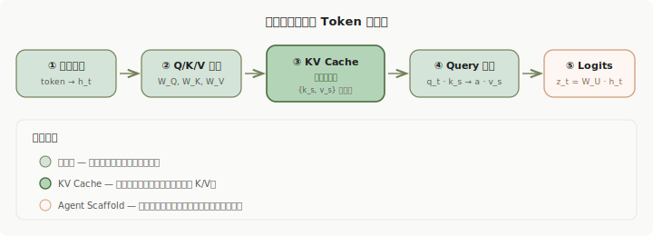

### 6.1 状态编码：token 先被写进残差流

一个 token 进入模型后，会先变成 embedding，再沿着每一层的残差主干不断演化。若把位置 `t` 在第 `l` 层的隐藏状态写成 `h_t^l`，可以粗略理解为：

$$
h_t^l = h_t^{l-1} + \mathrm{Attn}^l(\cdot) + \mathrm{MLP}^l(\cdot)
$$

残差流的角色是**当前步所有计算都必须经过的主通道**，承担的是即时计算，而非长期存储。所以任何控制信息，首先都得被写进残差流，才能继续被投影和传播。

### 6.2 投影：同一个状态被分成 Q / K / V

在每一层，隐藏状态会被投影成三份：

$$
q_t^l = W_Q^l h_t^l,\quad
k_t^l = W_K^l h_t^l,\quad
v_t^l = W_V^l h_t^l
$$

这里可以把三者分别理解为：

- **Query**：我现在在找什么
- **Key**：我将来会在什么情形下被找
- **Value**：我一旦被找回，能提供什么影响

对于持续控制来说，这一步非常关键。一个 token 的长期价值，取决于它能否形成：

- 高可匹配的 `key`
- 高可复用的 `value`

### 6.3 持久化：过去 token 的 K / V 被缓存

进入解码阶段后，所有过去位置 `s < t` 的 `k_s^l` 和 `v_s^l` 会被缓存下来：

$$
\mathcal{C}_t^l =
\{(k_1^l, v_1^l), (k_2^l, v_2^l), \ldots, (k_{t-1}^l, v_{t-1}^l)\}
$$

这就是 **KV Cache**。

这里要特别把一个常见混淆掰开：

- **残差流** 是当前 token、当前层里的工作带
- **KV Cache** 才是历史 token 被跨步持久化下来的可寻址状态

追问”模型内部真正被保留下来的长期状态是什么”，KV Cache 比残差流更接近正确答案。

这里还有一个容易产生困惑的问题：如果 KV 一旦写入就不变，为什么更深层的表示会”更语义、更整体”？

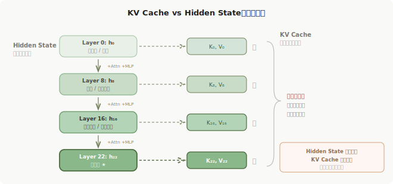

关键在于区分两个不同概念：

- **Hidden State（残差流）**：逐层演化，每经过一层 Attention + MLP，表示会变得更抽象、更整合上下文。Layer 0 的表示是词法级的，Layer 22 的表示已经编码了任务模式和角色信息。
- **KV Cache**：每层独立写入一份 K/V 快照，写完即冻结。后层不会回改前层的 KV。

所以”更深层语义更整体”描述的是 **hidden state 的逐层变换**，”旧 KV 不变”描述的是 **cache 的写入机制**。二者互补：模型在更深层生成更抽象的新表示，这些新表示以该层自己的 K/V 形式写入缓存，供未来 token 检索。Cache 里存的实际上是一串**分层快照**——浅层 K/V 保留局部特征，深层 K/V 承载高层语义，后续 query 可以在不同层选择性地读取不同粒度的控制信号。

### 6.4 读回：新的 Query 去匹配旧的 Key

当生成新 token `t` 时，当前层会用 `q_t^l` 去匹配历史位置的 `k_s^l`：

$$
a_{t,s}^l =
\mathrm{softmax}\left(\frac{(q_t^l)^\top k_s^l}{\sqrt d}\right)
$$

然后用这些权重把对应的 `v_s^l` 聚合回来：

$$
o_t^l = \sum_{s < t} a_{t,s}^l v_s^l
$$

这一步就是持续控制真正起作用的地方。  
如果某个早期 token 是：

- 一段 system instruction
- 一个 tool schema
- 一段 plan / reflection
- 一个结构边界非常清晰的控制标记

那么很多未来位置的 query 都可能重新访问它。于是这个 token 的 value 会在多个未来时刻被不断搬运回来，反复改写当前状态。

### 6.5 显化为动作：hidden state 最终改写 logits

在最后一层，聚合后的表示会被映射成 logits：

$$
z_t = W_U h_t^L
$$

这些 logits 直接决定当前步更可能输出什么：

- 是继续自然语言，还是进入 `tool_call`
- 是直接回答，还是先写 `Plan:`
- 是维持简洁风格，还是进入长篇铺垫
- 是不是按 memory schema 去组织输出

如果再把 Agent scaffold 也算进去，事情就更进一步了：

- 模型输出了 `tool_call`，外部执行器真的会调用工具
- 模型输出了 memory write，外部系统真的会更新记忆
- 模型输出了 plan，这段 plan 又会成为新的上下文，被未来再次访问

于是控制不再只停留在 logits 层，而会变成：

> **内部状态偏移 → 输出动作 → 新上下文生成 → 下一轮控制继续**

---

## 七、统一框架：两条传播路径，三层载体

做到这里，零散观察已经足够多了，需要一个统一框架把它们收起来。

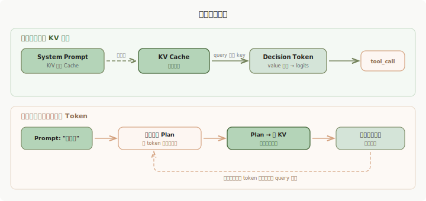

我更倾向于用下面这个框架来理解 Agent 中的持续控制状态：

### 三层载体

| 组件 | 角色 | 物理载体 |
| --- | --- | --- |
| **残差流（Residual Stream）** | 当前工作区 | 瞬时激活值 |
| **KV Cache** | 可寻址寄存器组 | 跨步持久化的 Key / Value |
| **Agent Scaffold** | 外部执行器 | 把输出解释成动作的运行时框架 |

### 两条传播路径

#### 路径一：直接 KV 读回

这条路径解释的是：

- 为什么 system prompt 明明很早，但关键决策位置仍然能直接回访它
- 为什么 tool schema 会在参数生成时被反复引用
- 为什么删掉某些早期 K / V，后续行为就会立刻衰减

这是最直接的“控制寄存器”路径。

#### 路径二：控制被写进新 token

这条路径解释的是：

1. 早期 prompt 要求“先规划”
2. 模型真的输出了一段 plan
3. 这段 plan 成为新的上下文
4. 后续步骤又不断读回这段新的 plan

于是持续控制不再只来自最初的 prompt，而会来自**它诱导写下来的次级控制状态**。

这也是为什么在 Agent 中，planning、reflection、memory write 非常关键：  
它们不仅是“结果”，也会变成新的控制源。

### 一个更准确的统一判断

因此，如果要把这篇文章压成一句统一判断，我会这样说：

> **持续控制状态来自多重机制的叠加：残差流中的写入、KV Cache 中的跨步持久化、以及 scaffold 放大后的新 token 回写，共同形成控制闭环。**

---

## 八、哪些 token 具有更高的“控制势能”

既然统一框架已经有了，下一步自然就是问：什么样的 token 更容易成为控制锚？

我认为高控制势能的 token，通常至少满足以下几类条件。

### 8.1 语义抽象度高

越抽象、越能覆盖很多未来决策的 token，越容易被长期复用。例如：

- “优先调用工具，不要猜测”
- “先规划，再执行”
- “输出必须符合 schema”

相比之下，一条只约束某个局部细节的 token，更像一次性约束，难以形成持续控制状态。

### 8.2 结构上高度显著

带有明显结构边界的 token 往往更容易形成稳定锚点，例如：

- XML / JSON 标签
- Tool schema 中固定字段名
- `Plan:`、`Reflection:`、`Memory:` 这类显式相位切换标记

这些 token 的意义不只是“更好读”，而是它们更容易被模型编码成将来可复访的控制锚。

### 8.3 位于因果链上游

在 causal Transformer 里，位置更早的 token 理论上拥有更大的潜在影响范围。  
但“早”本身不是充分条件，更准确的表述是：

> **越靠前的 token 拥有更大的控制半径，但只有那些 K / V 对大量未来 query 仍然有用的 token，才会真正形成高控制势能。**

### 8.4 容易被 scaffold 放大

有些 token 在模型内部未必最强，但一旦被外部系统接住，就会被放大成高杠杆动作。

例如：

- 一段 schema 让模型更容易输出合法 `tool_call`
- 工具一旦真的执行，结果会再次进入上下文
- 新上下文又会进一步改变后续 query 和 logits

所以在 Agent 场景里，一个 token 的控制势能不能只看模型内部，还得看它是否会被外部运行时放大。

---

## 九、这篇是一组可证伪的机制假说

到这里，需要诚实地说一句：这篇文章停留在机制探索层面，尚未形成封闭理论。目前还没有一个像优化理论那样的闭式定理，去完全刻画控制势能、注意力读回和 scaffold 放大之间的关系。

但这不代表它只能停留在空泛直觉。更合适的做法是把它收束成一组**可证伪假说**。

### 假说 1：KV Cache 是跨步持久化的核心载体，残差流负责单步内计算

残差流在单步内极其重要，但真正把历史状态跨步保存下来、供未来反复读取的，是每层缓存下来的 `K/V`。

这意味着：

- 关注长期控制，不能只盯着 residual stream
- 必须把 KV cache 当作一级研究对象

### 假说 2：高控制势能 token 的本质，是“更容易被未来 query 命中的 key”与“更能改写当前决策的 value”

这句话看起来简单，但它把“好 prompt”翻译成了一个更可研究的内部结构：

- 命中率问题：什么 token 更容易被未来 query 找到？
- 杠杆问题：什么 value 更能稳定改写 logits 分布？

### 假说 3：持续控制通常同时走两条路

也就是前面说的两条路径：

- 直接的 KV 读回
- 受控制影响的新 token 再次写回上下文

如果这个假说成立，那么 planning / reflection / memory write 不只是“让人类更好看懂模型思路”，而是在主动写新的控制寄存器。

---

## 十、怎么验证：五种因果干预方法

既然这是机制假说，就必须配一组能真正打断和救回这条路径的方法。

### 10.1 跨度消融（Span Ablation）

直接删掉某段早期上下文，例如 system prompt 里的工具定义。

观察：

- `tool_call` 相关 logits 是否显著下降
- 输出是否从结构化动作退化为自由文本
- planning / reflection / memory write 是否随之衰减

这一步先回答：**这段早期文本到底是不是重要。**

### 10.2 KV Cache 消融（KV Cache Ablation）

更强的一步是：

- 保留原始输入文本
- 但在推理时清空某些特定早期 token 对应的 K / V

如果文本仍在，但对应的 K/V 一被拿掉，后续 planning / tool selection 就明显衰减，那么就能更直接地说明：

> **持续影响依赖于未来步骤持续读取这些历史位置的 K/V——文本仍然存在并不足够。**

### 10.3 激活修补（Activation Patching）

构造两段 prompt：

- A：会稳定调用工具
- B：不会调用工具

如果把 A 在某层、某位置的激活或 K/V patch 到 B 的对应位置，然后 B 的工具调用意图被“救回来”，就说明该位置在该层确实承载了关键控制信号。

这能帮助回答：

- 控制信号主要在哪些层成形
- 是 residual stream 更关键，还是某些 attention 输出更关键
- tool schema、plan、reflection 分别主要作用在哪些层

### 10.4 Logit Lens / Probe

在中间层训练线性 probe，去预测：

- 模型是否即将进入 `tool_call`
- 模型是否已经进入 planning / reflection 模式

这能让控制状态逐层“显影”。  
它不直接等于因果证明，但非常适合做观测。

### 10.5 注意力追踪（Attention Tracing）

在真正发生动作决策的关键 token 位置，追踪高层 attention head，常常会看到：

- 当前 token 正在强力读回 system prompt
- 或者正在读回前面自己生成的 plan / reflection token

但要特别注意：

> **高 attention weight 是因果线索，不等于因果本身。**

所以 attention tracing 最好和 ablation / patching 联合使用。

---

## 十一、实验验证：在 Qwen2.5-0.5B-Instruct 上的机制观测

上面五种方法都已经有了操作定义。下面用一组真实实验来走完这条链条，看看前面的假说在真实模型上能得到多少支撑。

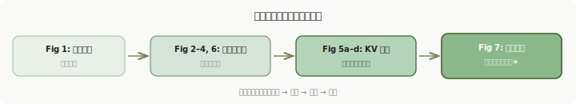

### 实验设置

模型选用 **Qwen2.5-0.5B-Instruct**（24 层 Transformer，约 5 亿参数），体积极小但具备 instruction following 和工具调用倾向。

Prompt 结构如下：

```
<|im_start|>system
You are a tool agent. Use specific formatting [TOOL] add(x,y).
<|im_end|>
<|im_start|>user
What is 15 plus 30?
<|im_end|>
<|im_start|>assistant
[
```

模型已经生成了 `[`，下一步最可能输出什么？如果 system prompt 中的工具指令真正形成了持续控制状态，模型应该以高概率继续输出 `TOOL`（即 `TO` + `OL`）。所有实验均在单张 RTX 3090 上运行，按"从观测到因果"的顺序依次展示。

### 11.1 概率偏移：System Prompt 将工具调用概率提升了四个数量级

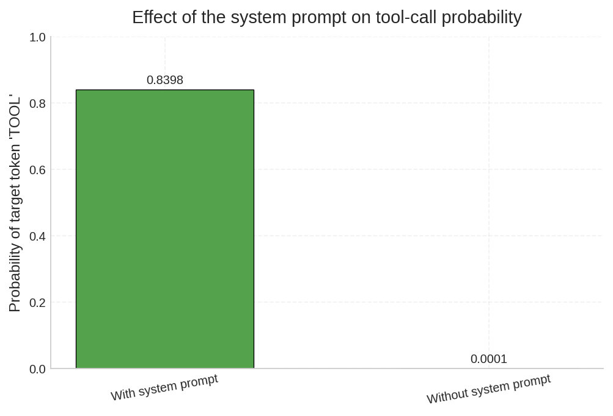

最基础的一步：直接对比有无 system prompt 时，模型在决策位置输出 `TOOL` 的概率。

| 条件 | `TOOL` 概率 | Top-1 预测 |
| --- | --- | --- |
| 含 system prompt | **83.98%** | `TO`（TOOL 的首 token） |
| 去掉 system prompt | **0.008%** | `1`（直接给数字答案） |

概率提升约 **10000 倍**。去掉 system prompt 后，模型的 top 预测变成了 `1`、`The`、`Solution`——完全退化为自然语言回答模式。

这对应第一节的判断：早期注入的控制 token 确实在几十个 token 之后仍然大幅改写了决策分布。现象已坐实。

### 11.2 逻辑透镜：工具调用信号在最后两层"结晶"

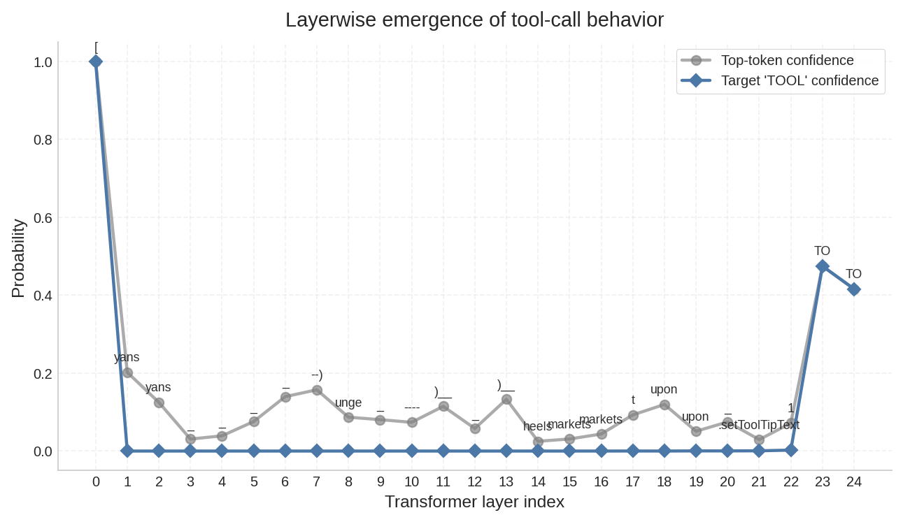

Logit Lens 把每一层的隐藏状态都投影到词表空间，观察"如果在这一层就做决策，模型会输出什么"：

```python
for i, layer_state in enumerate(hidden_states):
    # 取最后位置的隐藏状态，经 final LayerNorm 后投影到词表
    logits = lm_head(final_norm(layer_state[0, -1, :]))
    probs = softmax(logits, dim=-1)
    # 此时 probs 就是"如果在第 i 层就输出"的概率分布
```

结果呈现出一个清晰的 **U 形结构**：

- **Layer 0（Embedding 层）**：Top 预测是 `[`，概率接近 1.0。这是 embedding 层的直接映射——当前位置就是 `[`，投影自然命中自身，此时模型尚未做任何计算。
- **Layer 1–21（中间层）**：`TOOL` 信号完全消失。Top 预测在 `yans`、`unge`、`markets`、`.setToolTipText` 之间游走，概率均低于 0.15。模型正在做复杂的内部计算，但决策尚未成形。
- **Layer 22–24（最后三层）**：`TO` 突然涌现为 Top 预测，概率从 0 跃升至约 0.5。

这说明：工具调用决策在中间层被"隐式编码"在残差流中，直到最后两三层才被"解码"为显式的 token 选择。**控制状态的存在和控制状态的显化，是两个不同时刻。**

### 11.3 注意力回溯：决策点在持续寻址哪些历史 token

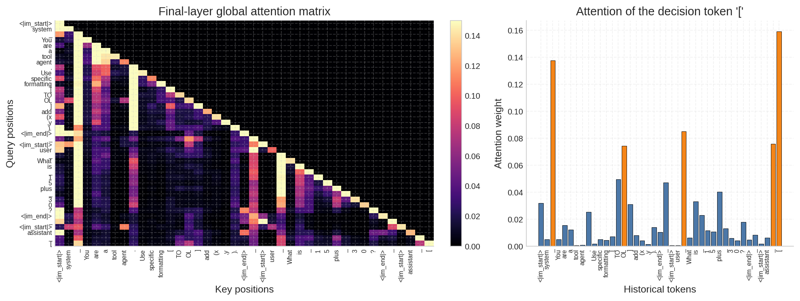

左侧是最后一层的完整注意力矩阵，右侧是决策 token `[` 对所有历史 token 的注意力分布。橙色标注的是注意力权重超过 0.05 的位置。

几个显著的被寻址目标：

- **结构边界标记**（`<|im_start|>`、`system`、`assistant`）：承担"相位锚"角色，注意力持续较高
- **换行符 `\n`**：分隔各 turn 的结构 token，同样被高强度寻址
- **`[`（位置 12，system prompt 中的工具格式标记）**：模型在决策时主动回访了早期的格式范例

这与第八节的判断一致：结构上高度显著的 token 更容易成为控制锚。

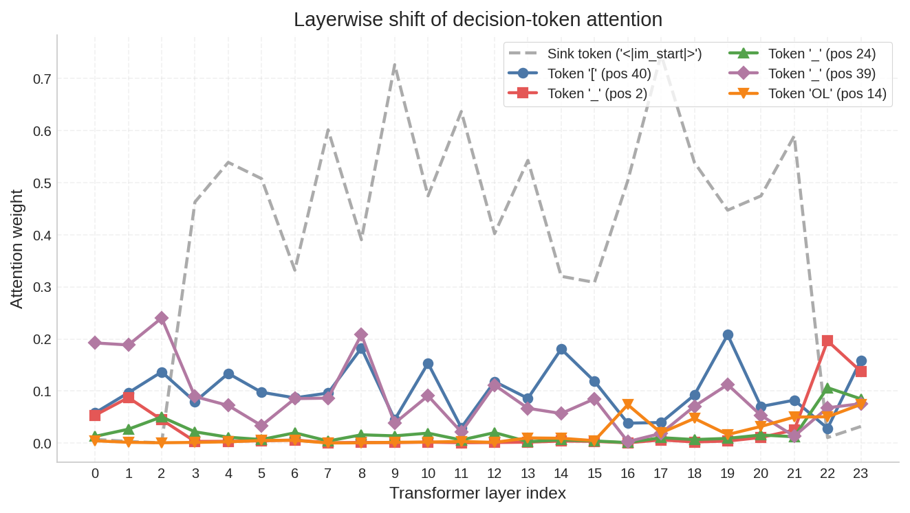

进一步追踪跨层演化，可以看到：

- **Sink token（`<|im_start|>`）**：在所有层中持续吸收大量注意力（灰色虚线），这是已知的 attention sink 现象
- **Token `[`（位置 40，决策位置自身）**：在 L0–L19 保持稳定的 0.1–0.2 注意力
- **最后三层（L21–L23）**：注意力急剧重新分配——sink 权重下降，`\n`（位置 2）和 `OL`（位置 14，TOOL 的一部分）等 token 的权重显著上升

模型在最后几层把注意力从泛化的结构锚转移到了具体的工具格式 token 上——正好对应 logit lens 中 `TO` 信号涌现的时机。

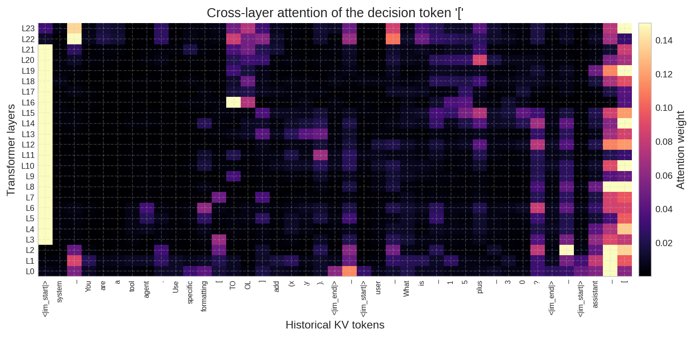

跨层热力图提供了更完整的全景：横轴是所有历史 KV token，纵轴是 Transformer 层级（从底到顶）。system prompt 区域（左侧）在高层持续被寻址，user query 区域（中部）的注意力相对稀疏。

但以上都是注意力观测——**高注意力权重是因果线索，还不是因果证明**。下面的消融实验和激活修补才是真正的因果干预。

### 11.4 KV Cache 消融：控制势能分布不均匀

通过 `register_forward_hook` 在推理时直接清零特定位置的 K/V 矩阵（保留原始文本不变），可以精确测量每组 token 对工具调用决策的因果贡献。

核心实现：先用 prefix 生成完整的 KV Cache，再对 cache 中指定位置的 K/V 清零，最后只喂最后一个 token 做推理：

```python
# 1. 用 prefix 生成完整 cache
prefix_outputs = model(prefix_ids, use_cache=True)
raw_past_kv = prefix_outputs.past_key_values

# 2. 深拷贝 cache 并清零目标位置的 K/V
import copy
new_cache = copy.deepcopy(raw_past_kv)
for i in range(len(new_cache.key_cache)):
    new_cache.key_cache[i][:, :, ablate_positions, :] = 0.0
    new_cache.value_cache[i][:, :, ablate_positions, :] = 0.0

# 3. 只喂最后一个 token，使用消融后的 cache
outputs = model(last_token_id, past_key_values=new_cache, use_cache=True)
```

这比 `attention_mask=0` 的方式更准确——后者只是把注意力权重置零，K/V 矩阵本身并未被清除。

**单点消融：清零单个 `[` 的 KV**

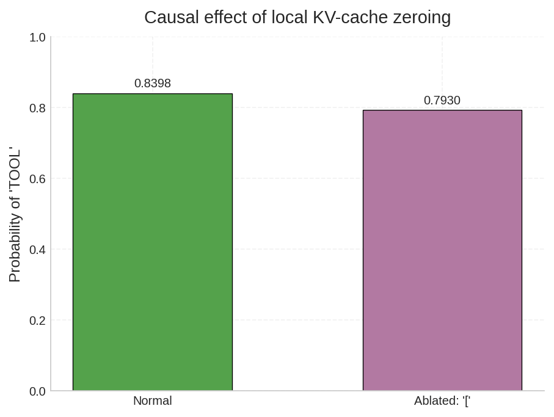

消融 system prompt 中 `[`（位置 12）的 KV 后，概率从 0.8398 降至 0.7930，仅下降 5.6%。

单个 token 的控制贡献有限——控制状态是分布式的，散布在多个 token 的 KV 中。

**多组独立消融：哪类 token 控制势能最高**

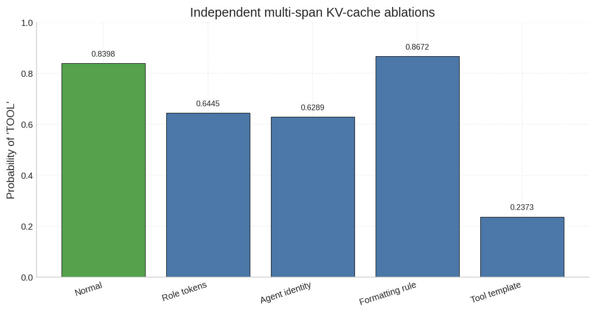

分别清零四类 token 的 KV，观察各自的独立影响：

| 消融目标 | 消融后概率 | 变化幅度 |
| --- | --- | --- |
| 基准（无消融） | 0.8398 | — |
| Role tokens（结构标记） | 0.6445 | **-23.3%** |
| Agent identity（`tool agent`） | 0.6289 | **-25.1%** |
| Formatting rule（`Use specific formatting`） | 0.8672 | +3.3% |
| Tool template（`[TOOL] add(x,y)`） | 0.2373 | **-71.7%** |

结果非常清晰：

- **Tool template 是压倒性的控制源。** 清零这些 KV 后，概率直接从 84% 跌到 24%。具体的格式范例才是真正的高势能 token。
- **Formatting rule 的消融反而略微提升了概率。** 抽象指令 `Use specific formatting` 与具体 template 之间存在微弱的竞争关系——去掉抽象描述后，模型更直接地依赖范例本身。
- **Role tokens 和 Agent identity 有中等影响。** 结构标记和身份声明提供了上下文框架，但对工具调用的直接驱动力不如具体范例。

这直接回应了第八节的问题。在这个实验中，控制势能的排序是：

> **具体格式范例 >> 角色标记 ≈ 身份声明 >> 抽象格式指令**

**累积消融：控制状态的逐层瓦解**

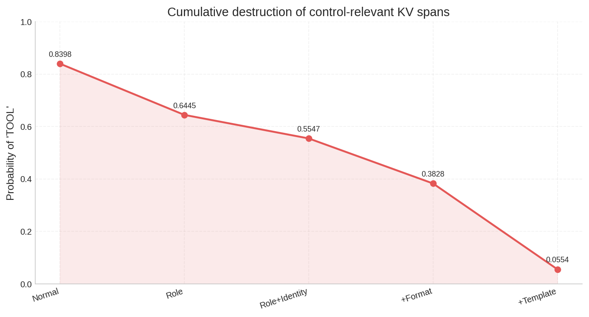

依次叠加消融 Role → Identity → Format → Template，观察概率的逐步退化：

| 累积阶段 | `TOOL` 概率 |
| --- | --- |
| Normal | **0.84** |
| + Role | **0.64**（结构框架被破坏） |
| + Identity | **0.55**（身份上下文丢失） |
| + Format | **0.38**（格式约束消失） |
| + Template | **0.06**（具体范例被抹除） |

这条衰减曲线说明两件事：

1. 控制状态确实分布在多个 KV 寄存器中，每一组被清零都会造成不可逆的退化
2. 最后一步（清零 template）造成了最大的断崖式下跌（0.38 → 0.06），再次确认具体范例是控制闭环中最关键的一环

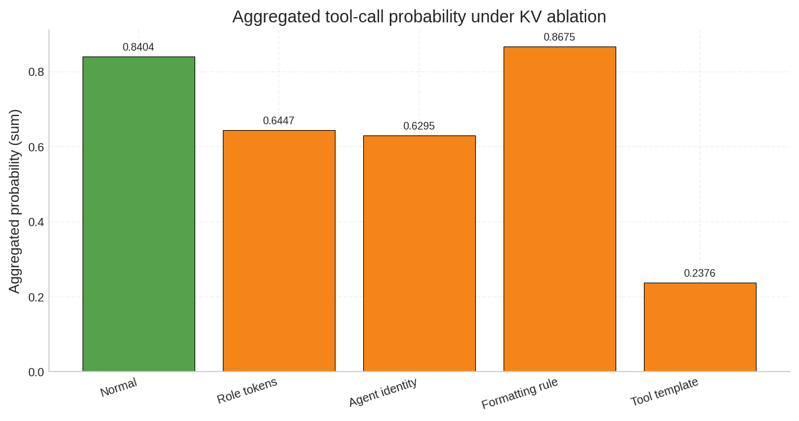

使用聚合指标（将所有工具调用相关 token 的概率加总）重复实验，结论完全一致。

### 11.5 激活修补：第 22 层是决策形成的因果关键

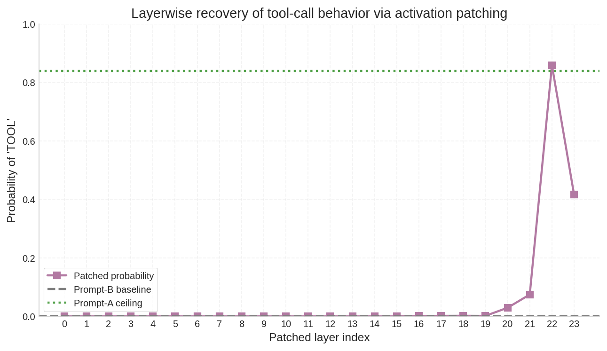

这是整组实验中**因果证据最强**的一个。

核心做法：对每一层，用 `register_forward_hook` 把 Prompt A 的隐藏状态 patch 到 Prompt B 的对应位置：

```python
for layer_idx in range(num_layers):
    # 取出 Prompt A 在第 layer_idx 层的最后位置隐藏状态
    patch_state = hidden_states_a[layer_idx + 1][0, -1, :].clone()

    def patch_hook(module, inputs, outputs):
        out = outputs[0]
        out[0, -1, :] = patch_state       # 替换最后位置
        return (out,) + outputs[1:]

    handle = model_layers[layer_idx].register_forward_hook(patch_hook)
    outputs_patched = model(**tokenize(prompt_b))  # 用 Prompt B 推理
    handle.remove()
    # 检查 Prompt B 的 TOOL 概率是否被"救回来"
```

构造两段 prompt：

- **Prompt A**（含 system prompt）：稳定触发工具调用，`TOOL` 概率 = 0.84
- **Prompt B**（无 system prompt）：不触发工具调用，`TOOL` 概率 = 0.0001

对每一层 `l`，把 Prompt A 在第 `l` 层最后位置的隐藏状态 patch 到 Prompt B 的对应位置，观察 Prompt B 的 `TOOL` 概率能否被"救回来"。

结果极其清晰：

| 层范围 | 恢复程度 | 含义 |
| --- | --- | --- |
| Layer 0–20 | ≈ 0.01（几乎无恢复） | 这些层的隐藏状态尚未编码出足够的工具调用信号 |
| Layer 21 | ≈ 0.03（微弱回升） | 控制信号开始凝聚 |
| **Layer 22** | **≈ 0.86（完全恢复）** | **决策在这一层形成** |
| Layer 23 | ≈ 0.42（回落） | 最后一层还需要额外的 MLP 和 LayerNorm 处理 |

三点关键发现：

1. **工具调用决策在第 22 层（倒数第 2–3 层）形成。** 之前所有层的 KV 读回、残差流积累，都在这一层被"结算"为具体的动作分布。

2. **三条独立证据链在同一个位置汇合。** Logit Lens 显示 `TO` 在 L22–23 涌现；attention tracing 显示 L22 注意力急剧重分配；activation patching 证明 L22 是因果瓶颈——三者完全一致。

3. **这是充分性证明。** 注意力观测只能给相关性，KV 消融给出必要性（拿掉就衰减），而 activation patching 给出充分性——把 L22 的状态搬过去，就能完整恢复行为。

### 11.6 实验小结

| 假说 | 验证方法 | 结果 | 状态 |
| --- | --- | --- | --- |
| **KV Cache 是跨步持久化核心载体** | KV 消融（Fig 5a–d） | 清零 KV 后概率大幅下降，文本仍在但控制丧失 | **支持** |
| **高控制势能 = 易命中的 key + 能改写决策的 value** | 多组消融对比（Fig 5b） | 具体范例 >> 角色标记 >> 抽象指令 | **支持** |
| **控制同时走直接 KV 读回 + 新 token 写回两条路** | Attention tracing + 消融 | 直接读回路径已验证；路径二需要多轮生成实验进一步确认 | **部分支持** |

额外发现：

- **决策层定位**：24 层模型中，工具调用决策在第 22 层形成（Activation Patching 证实）
- **控制势能 ≠ 语义重要性**：抽象的 `Use specific formatting` 反而有轻微负贡献，真正的控制杠杆在具体范例上

---

## 十二、对 Agent 工程意味着什么

如果把上面的机制看清楚，会发现很多 Agent 设计经验其实都可以被重新表述成“控制状态设计原则”。

### 12.1 System Prompt 是控制面，而非说明文

它不应该只是冗长散文，而应该尽量具备：

- 抽象度高
- 结构清晰
- 容易被未来很多位置重复利用

真正有效的 system prompt，往往是最容易被编码成高复用控制锚的，覆盖全面反而次要。

### 12.2 Tool Schema 不只是接口定义，而是控制接口

它不仅规定参数格式，也会持续改写模型的动作分布。

一个写得差的 schema 往往会导致：

- 模型更犹豫要不要调用工具
- 参数字段更容易填错
- 输出更容易退化成自然语言解释

从机制角度看，这相当于 schema 没有形成足够稳定、足够显著的控制锚。

### 12.3 Planning / Reflection 是主动写控制寄存器

要求模型“先想一想”“先列计划”，不只是为了让人类更容易审查。

在很多任务里，这实际上是在主动让模型**提前写下一批未来可以反复寻址的控制 token**。

这也解释了为什么 planning 并不是永远有效：

- 写得太空泛，后续 query 不会持续访问
- 写得太长太散，控制信号会被稀释
- scaffold 如果不消费这些计划，它们的杠杆也会下降

### 12.4 观测能力会成为 Agent 调优基础设施

要优化 tool selection、memory update、reflection 质量，只靠”改 prompt 试试看”会越来越低效。

更好的方向是建设：

- token / span 级 ablation 工具
- KV cache 级可视化与消融工具
- probe / logit lens 监测
- 关键决策位置的 attention tracing

这会让 Agent 调优从经验主义，逐步走向**可观测、可干预的机制工程**。

---

## 十三、最后收束：这篇文章真正要推进的是什么

把全文压成一句话，核心问题其实是：

> **Transformer 中，哪些 token 具有更高的控制势能？这些势能如何在残差流中被编码、在 KV Cache 中被持久化、再通过后续 query 的读回和 scaffold 的放大，转化为对 Tool Selection、Planning、Reflection 和 Memory Update 的持续偏置？**

如果要再进一步压缩成一句最简结论，我会这样说：

> **Agent 中所谓”持续控制状态”，本质是某些早期 token 通过残差流被写入、通过 KV Cache 被持久化、通过后续 query 被反复读回，并在 scaffold 的放大下持续改写未来动作分布。**

这件事的真正价值在于它改变了看待 Agent 的方式。

过去常把 prompt、tool schema、plan、reflection 看成”技巧”或”工作流习惯”；但如果从机制上看，它们更像是在模型内部和外部共同搭建的一套**控制平面（control plane）**。

一旦这样理解，后面的研究和工程目标就会非常清楚：

- 识别高控制势能 token
- 观察它们如何形成跨步状态
- 用因果干预去验证这条路径
- 再把验证结果回灌到 Agent 设计里

这才是“机制探索”真正值得推进的方向。
